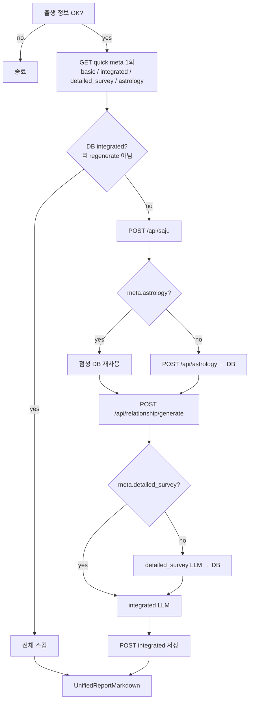

# WhoamI — 현재 생성·데이터 흐름 맵 (검수용)

> **목적**: Phase 2 이후 코드베이스의 *실제 동작*을 문서화. 최적화·리팩터 전 검토용.  
> **범위**: 2026-05 기준 `main` 워킹 트리. 프롬프트·UI·LLM 파이프라인 구조는 *기술하지 않음*(변경 금지 전제).  
> **상태**: 임시 초안 — `docs/dev-flow-current.md`

---

## 한눈에 보기

| 분석 종류 | LLM 모드 | DB 영속 | sessionStorage 가속 | 재생성 플래그 |
|-----------|----------|---------|---------------------|---------------|
| Basic (무료 4문단) | `free` (서버 `/api/my/report` 또는 `/api/llm`) | `report_analyses.basic` (+ legacy `report_results`) | `ahaitsme_basic_result_v1_{reportId}` | `regenerate=1` (GET) |
| Detailed survey | `detailed_survey` | `report_analyses.detailed_survey` | 없음 | `regenerateIntegrated=1` 시 삭제·재생성 |
| Astrology (integrated 입력) | `POST /api/astrology` 내부 LLM | `report_analyses.astrology` | 없음 | 출생 저장 시 삭제; `regenerateIntegrated` 시 **유지** |
| Integrated premium | `integrated` (P1+P2, stream) | `report_analyses.integrated` | `ahaitsme_unified_report_v1_{reportId}` | `regenerateIntegrated=1` |
| Relationship basic/premium | 별도 프롬프트 (`relationshipAnalysis`) | `relationship_reports.result_*` | 없음 | API별 재호출 로직 |

**Canonical 키**: 대부분의 개인 리포트 흐름은 `reports.id` (UUID) = `reportId`.  
**Integrated의 source of truth**: `report_analyses` (`analysis_type = 'integrated'`). sessionStorage는 표시 가속만.

---

## 1. Basic analysis (기본 분석)

### 트리거·화면

- **URL**: `/result?id={reportId}&view=basic` (또는 `view` 생략 → basic)
- **컴포넌트**: `app/report/reportcontent.tsx` → `FreeResultAccordions`
- **대시보드**: `app/dashboard/DashboardContent.tsx` (basic 탭)

### 클라이언트 흐름

```
ReportContent / Dashboard
  → fetchBasicAnalysisClient(reportId, { regenerate? })
       1) (옵션) cachedFromMeta → DB 취급, session 쓰기
       2) sessionStorage hit → 즉시 반환  ⚠ basic만 integrated보다 session 우선이 큼
       3) GET /api/my/report?reportId=&quick=1
       4) basic_result 없고 (regenerate | basic_pending) → GET full (quick 없음) → 서버 LLM
```

**관련 파일**

- `lib/report/fetchBasicAnalysisClient.ts`
- `lib/report/basicResultCache.ts`
- `app/api/my/report/route.ts` (GET — `runFreeAnalysis`)

### 서버 (`GET /api/my/report`)

| 쿼리 | 동작 |
|------|------|
| `quick=1` | DB/legacy만 읽기. LLM 호출 없음. `basic_pending` 플래그 반환 가능 |
| (quick 없음) | DB 없으면 `buildSurveyOnlyUserInputForReport` → `runFreeAnalysis` → `writePersistedBasicAnalysis` |
| `regenerate=1` | `report_analyses.basic` 삭제 후 위 full 경로 |

**LLM**: `app/api/llm/route.ts` `mode: "free"` 또는 GET 핸들러 내 인라인 동일 톤 프롬프트 (`gpt-4o-mini`).

### 출력·표시

- 4문단 평문 → 아코디언 4칸 (`freeAccordionBodies`)
- DB 저장 후 `basic_from_db: true` (quick 응답)

---

## 2. Detailed survey analysis

### 역할

- 18문항 Y/N **패턴**을 영역별(MBTI, DISC, …) 장문 해석으로 확장
- **Integrated LLM의 입력**으로만 사용 (단독 UI 없음)

### 호출·재사용 (`runPremiumReportPipeline`)

```text
1) GET /api/my/report?quick=1 → detailed_survey_result (DB)
2) 없고 regenerateIntegrated 아님 → POST /api/llm { mode: "detailed_survey", patterns }
3) 생성 후 POST /api/my/report { detailedSurvey } → report_analyses.detailed_survey
4) integrated LLM의 detailedSurvey 입력으로 사용
```

**관련 파일**

- `lib/report/persistDetailedSurveyClient.ts` — 조회·저장 클라이언트
- `lib/report/reportAnalyses.ts` — `readPersistedDetailedSurveyAnalysis` / `writePersistedDetailedSurveyAnalysis`
- `supabase/migrations/20260518120000_report_analyses_detailed_survey.sql` — `analysis_type` check 확장

### 영속성

- **DB**: `report_analyses` · `analysis_type = 'detailed_survey'` · `content` = LLM `report` 문자열
- **quick API**: `detailed_survey_result`, `detailed_survey_from_db` (has_premium일 때)
- integrated가 DB에 있으면 **파이프라인 전체 스킵** → detailed_survey LLM도 호출 안 함
- integrated 없고 detailed_survey만 DB에 있으면 → detailed_survey LLM 스킵, saju/점성/관계 등은 여전히 실행

### LLM

- `app/api/llm/route.ts` — `mode === "detailed_survey"`
- 모델: `gpt-4o-mini`, `max_tokens: 5000`

---

## 2b. Astrology (점성 integrated 입력)

### 역할

- 출생 시각·**위경도** 기반 차트 + **LLM 해석** (또는 해석 실패 시 `buildAstrologyContextForLlm` 폴백)
- integrated의 `astrologyText`에 넣기 **전** 로컬 점성 문자열만 저장 (관계 맥락은 파이프라인에서 별도 결합)

### 출생 좌표 해석 (`resolveAstrologyCoordinates`)

우선순위 (유료 geocoding 없음):

1. **`reports.birth_latitude` / `birth_longitude`** — `POST /api/report/birth` 또는 설문 patch 시 `birth_place` lookup으로 저장
2. **`birth_place` 문자열** — 내장 도시·지역 표 (`place_lookup`, 예: 부산·제주·도쿄·뉴욕)
3. **서울 기본값** — 매칭 실패 시 `37.5665, 126.978`, `timezone: 9` + `[astrology-coords] source=default_seoul` 경고 로그

`buildAstrologyApiRequestFromReport`가 파이프라인·관계 premium 분석에서 공통으로 `POST /api/astrology` body 생성 (`birthPlace`는 LLM 프롬프트 맥락용으로만 추가 전달).

### 호출·재사용 (`runPremiumReportPipeline`)

```text
1) GET /api/my/report?quick=1 → astrology_result, astrology_location_key
2) metadata.location_fingerprint === astrology_location_key 이면 API 스킵
3) 불일치(구 서울 고정 캐시 등) → astrology 행 삭제 후 재호출
4) 없으면 POST /api/astrology → persist + location_fingerprint
```

**관련 파일**

- `lib/report/resolveAstrologyCoordinates.ts`, `lib/report/buildAstrologyApiRequest.ts`
- `lib/report/astrologyIntegratedText.ts`, `lib/report/persistAstrologyClient.ts`
- `lib/report/syncReportBirthCoordinates.ts` — quick 조회 시 좌표 컬럼 백필
- `supabase/migrations/20260518140000_report_analyses_astrology.sql`
- `supabase/migrations/20260518150000_reports_birth_coordinates.sql`

### 영속성

- **DB**: `report_analyses.astrology` · `metadata.location_fingerprint`
- **reports**: `birth_latitude`, `birth_longitude`, `birth_timezone`

### 무효화

| 조건 | 동작 |
|------|------|
| `regenerateIntegrated=1` | astrology **유지** (fingerprint 동일 시 재사용) |
| `POST /api/report/birth` (날짜·시간·장소) | astrology 삭제 + 좌표 재계산 |
| 설문 submit에서 birth_* patch | astrology 삭제 + 좌표 재계산 |
| quick read 시 fingerprint 불일치 | astrology 행 삭제 |

### `regenerateIntegrated=1` 시 점성 재생성 여부 (결정)

동일 출생·좌표면 integrated만 다시 만들고 점성 LLM은 재호출하지 않음. 출생/좌표가 바뀌면 fingerprint가 달라져 자동 무효화.

### 검증 노트 (2026-05-18)

| 항목 | 결과 |
|------|------|
| DB 컬럼 미적용 시 | `fetchReportWithBirthCoords`가 좌표 컬럼 없이 fallback select → **GET 404/500 없음**; `birth_place` lookup만 사용 |
| birth/survey 저장 | `updateReportPatchSafely` — 좌표 컬럼 없으면 birth 필드만 저장 후 경고 |
| 구 astrology (fingerprint 없음) | `decidePersistedAstrologyReuse` → **삭제** (`cache=astrology_invalidated_location` reason=missing_fingerprint) |
| fingerprint 불일치 | **삭제** 후 재생성 (reason=fingerprint_mismatch) |
| quick 백필 | `quick=1` + lat/lon 비어 있을 때만 1회 `syncReportBirthCoordinates`; 이미 있으면 `skipped_already_set` |
| 관계 premium 점성 | `buildAstrologyApiRequestFromReport` 공유; **서울 하드코드 없음** |
| 수동 스크립트 | `node scripts/validate-astrology-cache.mjs` (3케이스 OK) |

**로그 접두사**

| 로그 | 의미 |
|------|------|
| `[astrology-coords] … source=stored_coords` | `reports`에 저장된 lat/lon 사용 |
| `[astrology-coords] … source=birth_place_lookup` | 내장 장소 표 매칭 |
| `[astrology-coords] … source=default_seoul` | 매칭 실패 폴백 |
| `[premium-report] … cache=astrology_reused` | DB astrology 재사용 |
| `[premium-report] … cache=astrology_invalidated_location` | 위치 fingerprint 불일치·누락으로 행 삭제 |

**남은 리스크**: 마이그레이션 전에는 좌표가 DB에 안 남아 매 요청 lookup 의존; lookup 미등록 장소는 여전히 `default_seoul`.

---

## 3. Integrated premium analysis (심화 통합)

### 전제 조건

- `reports.payment_status === "paid"` (또는 `plan_type === "paid"`)
- 출생 정보 완료: `birth_date`, `birth_time`, `birth_place` (`hasCompleteBirthInfo`)

### 파이프라인 순서 (`runPremiumReportPipeline`)



**단계 요약**

1. **메타 1회** — `fetchPremiumPipelineMetaClient` → `GET /api/my/report?quick=1`
2. **사주** — `POST /api/saju` (매 run, LLM 없음 — §3.1)
3. **점성** — DB `astrology` 또는 `POST /api/astrology` (§2b)
4. **관계** — `POST /api/relationship/generate` (DB 위주, §3.1)
5. **basic** — meta의 `basic_result`만 사용 (**파이프라인 내 free LLM 제거**, §3.1)
6. **detailed_survey** — meta 또는 LLM → DB (§2)
7. **integrated** — LLM → DB 저장

### 3.1 Premium pipeline upstream 입력 맵 (검수)

| 입력 | 소스 API/함수 | persisted? | 저장 위치 | deterministic? | integrated 입력? | 안전 재사용 (2026-05-18) | 재호출 리스크 |
|------|---------------|------------|-----------|----------------|------------------|-------------------------|---------------|
| **Survey patterns** | `reportcontent` → `surveyContextRef.patterns` (클라이언트 supabase `survey_responses`) | 설문 행만 | `survey_responses.answers` | Y (동일 answers) | detailed_survey LLM | 파이프라인 인자로 전달 (재조회 없음) | 낮음 |
| **pattern_base interpretations** | `loadSurveyPatterns` / `pattern_base` | DB 템플릿 | `pattern_base` | Y | free LLM에만 (파이프라인 **미사용**) | 파이프라인에서 `interpretations` 미사용 | — |
| **basic / free 요약** | `GET /api/my/report?quick=1` | Y | `report_analyses.basic` | LLM 생성분은 N | **아니오** (integrated 프롬프트에 없음) | meta `basic_result`만 반환용 | **제거됨**: 파이프라인 free LLM |
| **detailed_survey** | `POST /api/llm` `detailed_survey` | Y | `report_analyses.detailed_survey` | LLM N | **예** (`detailedSurvey`) | meta 1회 조회 후 재사용 | **낮음** (DB hit 시) |
| **saju payload** | `POST /api/saju` | 부분 | `saju_charts` (기둥만) | 계산 Y, 조회 해석 DB | **예** (`sajuData` JSON) | **미구현** (전체 JSON 미저장) | **중간** (매 run API, LLM 없음) |
| **astrology text** | `POST /api/astrology` | Y | `report_analyses.astrology` + `reports` lat/lon | 차트 Y, **해석 LLM N** | **예** | fingerprint 일치 시 API·LLM 스킵 | **낮음** (DB hit) |
| **relationship context** | `POST /api/relationship/generate` | Y | `relationship_reports.result_basic` | 포맷 Y, repair 시 LLM | **예** (combinedAstrology) | **미구현** (매 run DB read) | **중간** (DB; repair 시 LLM) |
| **integrated** | `POST /api/llm` `integrated` | Y | `report_analyses.integrated` | LLM N | 출력 | meta hit 시 **전체 스킵** | **낮음** (DB hit 시) |

**이번에 적용한 안전 재사용 (코드)**

- `fetchPremiumPipelineMetaClient` — quick 1회로 `basic_result` / `premium_result` / `detailed_survey_result` / `astrology_result`
- integrated DB 있으면 **saju·점성·관계·detailed_survey LLM 없이** 즉시 반환
- `astrology` DB hit 시 `POST /api/astrology` 스킵 (regenerateIntegrated여도 DB 유지·재사용)
- `basic_result`가 있으면 UI용 `freeSummary`만 채움; **없어도 파이프라인에서 free LLM 호출 안 함** (basic 탭·`/api/my/report` full이 담당)
- `detailed_survey` DB hit 시 LLM 스킵 (기존 + meta 공유)

**의도적으로 미적용 (신규 persist 없음)**

- **saju** 전체 응답 JSON — `saju_charts`는 기둥만 저장, integrated가 `dayStemData`·`tenGods` 등 전체 필요
- **relationship** — 이미 `relationship_reports`에 있으나 generate 라우트 재호출은 가벼움; repair 경로 LLM은 데이터 없을 때만

### 표시

- **Premium hero**: `isPremiumHeroActive` → `UnifiedReportMarkdown` (`parseReportStructure` / fallback markdown)
- **더 이상 사용 안 함 (premium 경로)**: `AdvancedExplorationReport` + `SAMPLE_DEEP_REPORT_DATA` (`getDeepReportData`가 `reportText` 무시)

### 중복 호출 방지 (Phase 2)

| 메커니즘 | 파일 |
|----------|------|
| DB 조회 후 파이프라인 생략 | `fetchIntegratedAnalysisClient`, `loadPremiumReport` |
| integrated LLM 직전 DB 재확인 | `runPremiumReportPipeline` |
| 동시 파이프라인 1회 | `lib/report/premiumPipelineLock.ts` (`runPremiumReportPipelineOnce`) |
| UI 인플라이트 락 | `premiumLoadInFlightRef` in `reportcontent.tsx` |
| 출처 로그 | `[premium-report] reportId=… source=db\|session\|generation\|regeneration` |

---

## 4. Premium tab entry (심화 탭 진입)

### URL·상태

| 파라미터 | 효과 |
|----------|------|
| `id` | `reports.id` — **Result 페이지는 URL id를 그대로 사용** (canonical resolver 없음) |
| `view=premium` | `resultViewTab = "premium"` |
| `regenerateIntegrated=1` | DB integrated 삭제 후 재생성 |
| `afterPayment=1` | 결제 후 출생 입력 플로우 (`deepFlow`) |

### `isPremiumHeroActive` 조건

```text
payment_status === "paid"
AND sajuStatus.ok === true
AND (reportStreaming OR unifiedReport 비어있지 않음)
AND resultViewTab === "premium"
AND deepFlow === null
```

### 로드 시퀀스 (`reportcontent.tsx`)

1. **`fetchCore` (마운트)**  
   - session: 미리보기만 (`fetchCore-preview`)  
   - paid + 출생 완료 → `fetchIntegratedAnalysisClient` (DB only)  
   - DB hit → `premiumPipelineStartedRef = true`

2. **`useEffect` → `loadPremiumReport`** (premium 탭 + 로딩 완료)  
   - regenerate → cache 삭제, `regenerateIntegrated` API, 파이프라인  
   - else → DB → 없으면 `runPremiumReportPipelineOnce`

3. **탭 전환** — `goPremiumResultTab()` → `router.replace(…&view=premium)` + `loadPremiumReport()`

### 대시보드 premium

- `DashboardContent`: `my.premium_result` from `GET /api/my/report?quick=1`  
- 있으면 `UnifiedReportMarkdown`; 없으면 “심화 리포트 전체 보기” 링크 → `/result?…&view=premium`

---

## 5. Relationship analysis (현재 존재 여부)

**있음.** 개인 integrated와 **별도 제품 surface**.

### 데이터 모델

- 테이블: `relationship_reports`  
  - `report_id_a`, `report_id_b`  
  - `analysis_type`: `basic` | `premium`  
  - `result_basic`, `result_premium` (JSON)

### API·UI

| API | 용도 |
|-----|------|
| `POST /api/relationship/create` | 관계 행 생성 |
| `POST /api/relationship/analyze/basic` | 18문항 4축 JSON → `result_basic` |
| `POST /api/relationship/analyze/premium` | 사주·점성 포함 → `result_premium` |
| `GET /api/relationship/list` | 허브·대시보드 목록 |
| `GET /api/relationship/detail` | `RelationshipView` |
| `POST /api/relationship/generate` | **개인 integrated용** 맥락 문자열 발췌 |

### Integrated와의 연결

- Premium 파이프라인이 `relationship/generate` 호출  
- `formatResultBasicForIntegratedContext`로 `result_basic` JSON에서 텍스트 추출  
- `astrologyText`와 합쳐 `combinedAstrology` → integrated LLM 입력

### `report_analyses.analysis_type = 'relationship'`

- 스키마·타입에 **정의만** 있음 (`lib/report/reportAnalyses.ts`)  
- **현재 코드 경로에서 read/write 사용 없음**

---

## 6. reportId canonicalization

### 서버 canonical (로그인 사용자)

`lib/home/resolveCanonicalReport.ts` + `GET /api/home/resume`:

1. Clerk `userId` 소유 `reports` 최대 30건  
2. `reportId` 힌트(URL/localStorage) 검증·orphan claim (`clerk_user_id` null)  
3. **설문 완료된 리포트 중 최신** 우선  
4. 없으면 힌트 또는 최신 owned  
5. 힌트와 pick 불일치 → `invalidHint: true`

**클라이언트 동기화**: `applyResumeReportIdToStorage` → `localStorage.reportId = canonical`

### 클라이언트 canonical (Result / Report / 관계)

**2026-05-18 이후** — URL id는 힌트만, DB/API는 canonical만 사용.

| 진입점 | URL 힌트 | Hook / 유틸 | URL 동기화 |
|--------|----------|-------------|------------|
| `/result`, `/report` | `?id=` | `useCanonicalReportId` (`queryParam=id`) | 불일치 시 `router.replace`로 `id` 갱신 |
| `/relationships` | `?myReportId=` (또는 `reportId`) | 동일 (`queryParam=myReportId`) | `myReportId` 갱신 |
| `/relationship/[id]` | `?viewer=` | 동일 (`queryParam=viewer`) | `viewer` 갱신 |
| `/dashboard` | `?reportId=` | `fetchHomeResumeClient` + `syncCanonicalReportId` (기존) | 동일 패턴 |

**구현 파일**

- `lib/home/resolveCanonicalReportIdClient.ts` — resume 호출 + 비로그인 힌트 폴백  
- `lib/home/useCanonicalReportId.ts` — 페이지 훅  
- `lib/home/canonicalReportIdLog.ts` — `[canonical-report] urlHint=… canonical=…` 로그  

**`app/report/reportcontent.tsx`**

- `urlReportIdHint` = URL `id`  
- `reportId` = hook의 `canonicalReportId` (basic / integrated / invite / supabase 조회 전부)  
- `canonicalResolving` 동안 데이터 fetch 보류  

**비로그인 폴백**

- `/api/home/resume` 401 → URL 또는 `localStorage.reportId` 힌트를 canonical로 사용 (`guest-fallback` 로그)  
- 로그인 후 다음 방문부터 resume canonical 적용  

### 기타 reportId 출처

| 위치 | 키 |
|------|-----|
| localStorage | `reportId` (canonical과 동기화) |
| localStorage | `inviteToken`, `gender_{reportId}` |
| localStorage | `ahaitsme_deep_report_pre_form_intro_v1_{reportId}` |
| 설문 | `app/survey/page.tsx` → submit 시 body.reportId |

---

## 7. DB storage locations

### Supabase (주요)

| 테이블 | 저장 내용 |
|--------|-----------|
| `reports` | 사용자, 결제, 출생, `birth_place`, **`birth_latitude`/`birth_longitude`/`birth_timezone`**, `payment_status`, `plan_type` |
| `survey_responses` | 18문항 `answers` (report_id FK) |
| `report_analyses` | LLM 본문: `basic`, **`integrated`**, **`detailed_survey`**, **`astrology`**, (`premium`, `relationship` 타입은 미사용) |
| `report_results` | **legacy** basic (`analysis_result`) — read 폴백만 |
| `relationship_reports` | 관계 분석 JSON |
| `saju_charts` | 사주 계산 결과 (`/api/saju`) |
| `pattern_base` | 설문 패턴 → 해석 템플릿 (read only, 클라이언트 supabase) |

### `report_analyses` 제약

- `UNIQUE (report_id, analysis_type)`  
- upsert `onConflict: "report_id,analysis_type"`  
- 읽기: 최신 `updated_at` 1건; 중복 시 prune + warn

### API가 DB에 쓰는 경로

| 분석 | Write 경로 |
|------|------------|
| basic | `GET /api/my/report` (full), `writePersistedBasicAnalysis` |
| integrated | `POST /api/my/report` `{ integrated }` |
| detailed_survey | `POST /api/my/report` `{ detailedSurvey }` |
| astrology | `POST /api/my/report` `{ astrology }` |
| integrated | `POST /api/my/report` `{ integrated }` |
| relationship | `relationship/analyze/*` → `relationship_reports` |

---

## 8. Cache / sessionStorage usage

| 키 패턴 | 용도 | Source of truth |
|---------|------|-----------------|
| `ahaitsme_basic_result_v1_{reportId}` | basic 표시 가속 | DB (`report_analyses.basic`) |
| `ahaitsme_unified_report_v1_{reportId}` | integrated **미리보기** + 가속 | DB (`report_analyses.integrated`) |
| `localStorage.reportId` | canonical 힌트 | 서버 `resolveCanonicalReport` |
| `localStorage.inviteToken` | 초대 플로우 | invites 테이블 (별도) |

### Integrated session 규칙 (Phase 2)

- `fetchIntegratedAnalysisClient`: **API(DB)만** 조회; session으로 `ok: true` 반환하지 않음  
- `reportcontent`: session은 `fetchCore-preview` / `load-preview` 라벨로만 선표시 → **DB 응답이 오면 덮어씀**  
- DB hit 후 `writeUnifiedReportCache`로 session 갱신

### Basic session (비대칭)

- `fetchBasicAnalysisClient`는 **session이 DB quick보다 먼저**일 수 있음 → basic은 구형 동작 유지 (최적화 대상)

---

## 9. Regeneration rules

### Basic

| 플래그 | 위치 | 효과 |
|--------|------|------|
| `regenerate=1` | `GET /api/my/report` | `deleteReportAnalysis(basic)`; full GET 시 재생성 |
| UI “다시 시도” | `reportcontent` | `loadBasicAnalysisForResult(reportId, { regenerate: true })` |

클라이언트: `clearBasicResultCache` on regenerate.

### Integrated (premium)

| 플래그 | 위치 | 효과 |
|--------|------|------|
| `regenerateIntegrated=1` | `GET /api/my/report` | `deleteReportAnalysis(integrated)`; `premium_result: null` |
| `regenerateIntegrated=1` | URL `/result?...` | `loadPremiumReport` regenerate 분기 |
| `regenerateIntegrated=1` | `GET /api/my/report` | `integrated` + **`detailed_survey`** 행 삭제 |
| `{ regenerate: true }` | `runPremiumReportPipeline` options | DB 재사용 없이 full run |

순서 (regenerate UI):

1. `clearUnifiedReportCache`  
2. `clearPremiumPipelineLock`  
3. `fetchIntegratedAnalysisClient(..., { regenerate: true })` → API에서 DB 삭제  
4. `runPremiumReportPipelineOnce(..., { regenerate: true })`

### detailed_survey / astrology / relationship

- **detailed_survey**: `regenerateIntegrated=1` 시 삭제 → 파이프라인에서 LLM 재생성  
- **astrology**: `regenerateIntegrated` 시 **삭제하지 않음** — DB 있으면 API 스킵 (§2b)  
- **relationship**: 명시적 regenerate 없음; integrated 재실행 시 generate 라우트는 다시 호출 (DB read 위주)

---

## 10. Known remaining risks (최적화 전)

### P0 — 동작/비용

1. ~~**Result URL vs canonical reportId**~~ **(완화됨 2026-05-18)**  
   - Result/Report·관계 허브/관계 상세는 `useCanonicalReportId`로 resume canonical 사용.  
   - **남은 리스크**: 비로그인 방문자는 여전히 URL 힌트 폴백만 가능.

2. **Integrated 파이프라인 “부분 재실행”** **(완화됨 2026-05-18)**  
   - integrated DB hit 시 **파이프라인 시작 직후 전체 스킵**.  
   - integrated 없고 detailed_survey·astrology만 DB에 있으면 → 해당 LLM/API 스킵; **saju·relationship/generate는 여전히 매 run**.

3. ~~**detailed_survey 비영속**~~ **(완화됨 2026-05-18)**  
   - `report_analyses.detailed_survey`에 저장·재사용.

4. ~~**점성학 API LLM 매 run**~~ **(완화됨 2026-05-18)** · ~~**서울 고정 좌표**~~ **(완화됨 2026-05-18)**  
   - `birth_place` lookup + `reports` 좌표 컬럼 + fingerprint 무효화.  
   - **남은 리스크**: lookup 표에 없는 읍·면·동·해외 소도시는 여전히 서울 폴백; DST 미반영(고정 timezone); 프롬프트만 변경 시 구 캐시 유지.

5. **사주 API 재계산**  
   - LLM은 없으나 매 run `POST /api/saju` + DB rule 조회. 전체 JSON persist 시에만 스킵 가능.

4. **Basic session vs DB 우선순위**  
   - basic은 session이 DB보다 앞서면 **오래된 session** 표시 가능 (integrated와 정책 불일치).

### P1 — 일관성/운영

5. **`report_analyses.premium` / `relationship` 미사용**  
   - 스키마만 존재; 실제는 `integrated` vs `relationship_reports` 이원화.

6. **`sajuStatus.ok` 게이트**  
   - DB에서 integrated만 로드해도 `sajuStatus.ok = true`로 설정 → 사주 API 실패 이력과 무관하게 premium hero 가능 (의도적 완화인지 검토 필요).

7. **POST integrated 멱등성**  
   - 동일 본문도 upsert overwrite. 파이프라인 이중 완료 시 마지막 write 승리 (행 중복은 unique로 방지).

8. **스트리밍 중 새로고침**  
   - stream 미완료 시 DB 없음 → 재방문 시 파이프라인 재시작 (부분 텍스트 유실).

### P2 — 제품/UX (문서만)

9. **`AdvancedExplorationReport` / `SAMPLE_DEEP_REPORT_DATA`**  
   - Post-MVP 매핑 전까지 premium에서 미사용; 데모·스토리북 잔존.

10. **RLS**  
    - `report_analyses`는 service role API만; 클라이언트 supabase 직접 읽기 없음 (의도된 설계).

---

## 부록: 주요 파일 인덱스

| 영역 | 파일 |
|------|------|
| 결과 UI | `app/report/reportcontent.tsx`, `app/result/page.tsx` |
| Basic fetch | `lib/report/fetchBasicAnalysisClient.ts` |
| Integrated fetch/save | `lib/report/fetchIntegratedAnalysisClient.ts` |
| Premium pipeline | `lib/report/runPremiumReportPipeline.ts`, `lib/report/premiumPipelineLock.ts` |
| DB helpers | `lib/report/reportAnalyses.ts` |
| Meta API | `app/api/my/report/route.ts` |
| LLM | `app/api/llm/route.ts` |
| Canonical | `lib/home/resolveCanonicalReport.ts`, `lib/home/fetchHomeResumeClient.ts` |
| 로깅 | `lib/report/premiumContentSourceLog.ts` |
| Canonical (클라) | `lib/home/useCanonicalReportId.ts`, `resolveCanonicalReportIdClient.ts` |
| detailed_survey | `lib/report/persistDetailedSurveyClient.ts` |
| astrology | `persistAstrologyClient.ts`, `astrologyIntegratedText.ts`, `resolveAstrologyCoordinates.ts`, `buildAstrologyApiRequest.ts`, `fetchReportWithBirthCoords.ts`, `astrologyCacheValidation.ts`, `astrologyCoordLog.ts` |
| 검증 스크립트 | `scripts/validate-astrology-cache.mjs` |
| Pipeline meta (quick 1회) | `lib/report/fetchPremiumPipelineMetaClient.ts` |
| 마이그레이션 | `supabase/migrations/20260516130000_report_analyses.sql`, `20260518120000_report_analyses_detailed_survey.sql`, `20260518140000_report_analyses_astrology.sql` |

---

## 변경 이력

| 날짜 | 메모 |
|------|------|
| 2026-05-18 | Phase 2 완료 기준 초안 작성 (검수용, 코드 변경 없음) |
| 2026-05-18 | P0 canonical: Result/Report·관계 경로에 `useCanonicalReportId` 적용 |
| 2026-05-18 | detailed_survey → `report_analyses.detailed_survey` 영속·파이프라인 재사용 |
| 2026-05-18 | upstream: quick meta 1회, basic 파이프라인 LLM 제거, upstream 입력 맵 §3.1 |
| 2026-05-18 | astrology → `report_analyses.astrology` 영속; regenerateIntegrated 시 유지; birth 저장 시 삭제 |
| 2026-05-18 | 출생 좌표: `birth_place` lookup + reports lat/lon; 서울 하드코드 제거; fingerprint 무효화 |
| 2026-05-18 | 검증: 마이그레이션 fallback, 캐시 무효화, quick 백필 1회, coord/cache 로그 |
