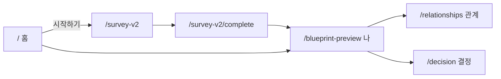
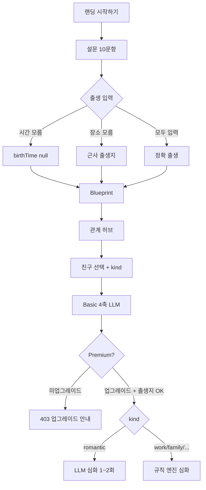

# 메뉴 구조도(IA) & 유저 행동 지도(User Journey)

> **작성일:** 2026-07-08  
> **코드 기준:** `main` @ `267170e` (Stitch UI + `reportSession` SSOT)  
> **참조:** `lib/stitch/hubPaths.ts`, `app/homecontent.tsx`, `lib/home/reportSession.ts`

---

## 1. 메뉴 구조도 (IA)

### 1.1 전체 트리

```
WhoamI (/)
│
├── 🏠 홈 허브
│   └── /                          랜딩, [시작하기], 로그인 모달
│
├── 👤 나 (Blueprint) 허브
│   ├── /blueprint-preview         6축 무료 대시보드 (Current vs Innate)
│   ├── /blueprint-preview/[id]/current      Current Self Lite 상세
│   ├── /blueprint-preview/[id]/innate       Innate Self Lite 상세
│   └── /blueprint-preview/[id]/innate/deep   유료 Deep 통합 리포트
│
├── 💞 관계 허브
│   ├── /relationships             친구 목록·초대·분석 시작
│   └── /relationship/[id]         관계 분석 상세 (basic / premium)
│
├── 📝 결정 허브
│   ├── /decision                  의사결정 저널
│   └── /decision/history          저널 기록 목록
│
├── 📋 온보딩 (설문·출생)
│   ├── /survey-v2                 v2 설문 10문항
│   ├── /survey-v2/complete        출생 정보 입력 + [결과 보기]
│   └── /onboarding/birth          출생 정보 독립 편집
│
├── 🔗 초대
│   └── /invite?token=             초대 토큰 수신 → 홈으로 리다이렉트
│
├── 🔐 인증
│   ├── /sign-in/[[...sign-in]]    Clerk 로그인
│   └── /sign-up/[[...sign-up]]    Clerk 회원가입
│
├── 📣 마케팅·법적
│   ├── /about
│   ├── /how-it-works
│   ├── /pricing
│   ├── /faq
│   ├── /contact
│   ├── /terms
│   ├── /privacy
│   ├── /refund
│   └── /account                   계정·출생 정보 수정
│
└── 🧩 전역 크롬 (모든 페이지 공통)
    ├── StitchFixedHeader          우상단 로그인 (홈: 커스텀 모달)
    ├── StitchAppFooter            / 제외
    └── StitchScrollDock           홈·Blueprint·관계·결정 빠른 이동
```

### 1.2 4대 허브 요약

| 허브 | URL | 주요 쿼리 | 역할 |
|------|-----|-----------|------|
| 홈 | `/` | `?token=` (초대) | 랜딩, 신규 진입, 로그인 |
| 나 | `/blueprint-preview` | `?reportId=` | 개인 6축 대시보드, Lite/Deep |
| 관계 | `/relationships` | `?myReportId=`, `?section=add` | 친구·초대·관계 분석 |
| 결정 | `/decision` | — | 결정 저널 (localStorage) |

**경로 헬퍼** (`lib/stitch/hubPaths.ts`):

- `blueprintPath(reportId?)` → `/blueprint-preview?reportId=...`
- `relationHubPath(reportId?)` → `/relationships?myReportId=...`
- `DECISION_HUB_PATH` → `/decision`
- `readStoredReportId()` → `localStorage.reportId` (힌트만, SSOT 아님)

### 1.3 API 라우트 (백엔드, 32개)

페이지와 직접 연결되는 주요 API:

| 영역 | 엔드포인트 |
|------|-----------|
| 세션·재개 | `GET /api/home/resume` |
| 설문 | `GET/POST/DELETE /api/v2/survey` |
| 출생 | `GET/POST /api/report/birth` |
| 개인 분석 | `GET/POST /api/my/report`, `/api/v2/lite/*`, `/api/v2/deep/innate` |
| 관계 | `/api/relationship/list`, `analyze/basic`, `analyze/premium`, `manual`, `upgrade` |
| 초대 | `/api/invite/create`, `accept`, `complete`, `cancel`, `status` |

---

## 2. 유저 행동 지도 (User Journey)

### 2.1 핵심 플로우 — 신규 게스트 (정본)

```
[랜딩 /]
    │
    ▼ [시작하기] 클릭
[StartChoiceModal]
    ├─ "시작하기 (무료 설문)" ──► POST 새 reports 행 생성 ──► /survey-v2?reportId=
    └─ "로그인" ──► 홈 커스텀 auth 모달 (Clerk SignIn)
    │
    ▼
[/survey-v2] 설문 10문항
    │  (조건: reportId 없음 → / 또는 /?token=)
    │  (조건: 이미 완료 → /survey-v2/complete 로 스킵)
    ▼ 10문항 완료
[/survey-v2/complete]
    │  (조건: 설문 세션 없음 → /)
    │  (조건: 출생 이미 있음 → Blueprint 직행)
    │  phase: boot → analyzing(2.8s) → birth 폼
    ▼ [결과 보기]
    │  POST /api/report/birth
    │  ┌─ birthTimeUnknown → birthTime: null (12:00으로 계산)
    │  └─ birthPlaceUnknown → "San Francisco, CA" 고정 fallback
    ▼
[/blueprint-preview?reportId=]  ← Blueprint 6축 대시보드
    │  (조건: 설문 미완 → /survey-v2)
    │  (조건: 출생 미입력 → /survey-v2/complete)
    ▼ (선택)
    ├─ /blueprint-preview/[id]/current   Current Self Lite
    ├─ /blueprint-preview/[id]/innate    Innate Self Lite
    └─ /blueprint-preview/[id]/innate/deep  유료 Deep (로그인·결제 게이트)
```

### 2.2 로그인 사용자 — 홈 자동 스킵

```
[랜딩 /] + 로그인 상태
    │
    ▼ loadReportSession() — /api/home/resume (60초 캐시)
    │
    ├─ 설문 완료 + 출생 최소(birthDate) 있음
    │       └──► router.replace(/blueprint-preview?reportId=)  ← 랜딩 스킵
    │
    └─ 미완료 → 랜딩 유지 (시작하기로 이어서 진행)
```

**관문 함수:** `hasResultsDashboardPrerequisites` (`lib/v2/results/canShowResultsDashboard.ts`)

- 설문: `surveyCompleted` (DB) 또는 `hasSurveyV2Session` (localStorage)
- 출생: `birthDate` (DB) 또는 `hasBirthV2Session` (localStorage)
- **최소 출생:** 생년월일만 있으면 OK (`hasMinimalBirth`)

### 2.3 출생 정보 분기 (시간·장소 모름)

```
[출생 입력 폼]
    │
    ├─ birthDate (필수, YYYY-MM-DD 10자)
    │
    ├─ birthTimeUnknown = true  ──► birthTime 생략 가능 → 서버 null → 사주는 12:00 기준
    │   birthTimeUnknown = false ──► birthTime 필수
    │
    └─ birthPlaceUnknown = true  ──► birthPlace 생략 가능
        │                              → 저장 시 "San Francisco, CA" + 고정 좌표
        birthPlaceUnknown = false ──► birthPlace 필수 (trim)
        │
        ▼
[Blueprint / Basic 관계 분석]  ──► 출생지 없어도 진행 가능
[Pricing / Premium 관계 심화]  ──► 양쪽 birth_place 필수 (아래 §2.6)
```

### 2.4 관계 분석 플로우

```
[Blueprint 완료] 또는 [도크·푸터 → 관계]
    │
    ▼
[/relationships?myReportId={reportId}]
    │  (조건: hubReportId 없음 → Blueprint 완료 안내)
    │
    ├─ [친구 초대] ──► POST /api/invite/create → /invite?token= 공유
    │       └── 수락자: /invite → localStorage.inviteToken → /?token=
    │           → 시작하기 → report_type: "relationship" → 설문 플로우
    │           → POST /api/invite/complete → relationship_reports 생성
    │
    ├─ [직접 입력] (로그인 필요) ──► POST /api/relationship/manual
    │       └── partner_manual 리포트 + relationship_report_id
    │
    └─ [친구 선택 → 관계 유형 선택 → 분석 시작]
            │
            ▼
[/relationship/{rrId}?viewer={myId}&kind={kind}&autostart=1]
    │
    ├─ 1) basic 자동 실행 (없을 때 ensureBasic)
    │       └── 설문 패턴만, LLM 1회, 출생지 불필요
    │
    └─ 2) autostart=1 → premium 자동 시도
            ├─ analysis_type = premium → runPremium
            ├─ premiumPreview (dev) → upgrade preview + runPremium
            └─ 미업그레이드 → 403 (UI에서 업그레이드 안내)
```

**관계 유형 (`kind`):** `romantic` | `family` | `work` | `friendship` | `cohabitation`

**가족 추가 파라미터:** `childIsViewer`, `parentType` (father | mother)

### 2.5 초대 수락 전체 시퀀스

```
[초대자] 관계 허브 → 초대 링크 생성 (/invite?token=XXX)
    │
    ▼
[수락자] 링크 클릭
    │
    ▼ /invite?token=XXX
    localStorage.inviteToken 저장
    router.replace(/?token=XXX)
    │
    ▼ 홈 [시작하기]
    createReport(report_type: "relationship", plan_type: "paid")
    │
    ▼ /survey-v2?token=  (또는 ?reportId=)
    설문 → complete → Blueprint
    │
    ▼ (초대자 쪽) outbound_waiting 상태 → 22초 폴링
    수락 완료 후 relationship_report_id 연결
    │
    ▼ 양쪽 관계 허브에서 분석 시작 가능
```

### 2.6 Premium 심화 분석 게이트 (관계)

```
[관계 상세 /relationship/[id]]
    │
    ▼ Basic 완료 (result_basic 캐시)
    │
    ▼ Premium 요청
    │
    ├─ analysis_type ≠ "premium" ──► 403 "결제·업그레이드 후 실행"
    │
    ├─ 양쪽 birth_date 없음 ──► 400 kind별 출생 오류 메시지
    │
    ├─ 양쪽 birth_place 비어 있음 ──► 400 "양쪽 모두 생년월일·출생지가 있어야..."
    │       ※ 수동 입력 시 birthPlaceUnknown 허용했어도 심화는 거절
    │
    └─ 통과 ──► kind별 엔진 실행
            ├─ romantic: LLM 1~2회 (최대 300초)
            └─ work/family/friendship/cohabitation: 규칙 엔진 (LLM 0회)
```

### 2.7 재방문·이어하기 경로

| 경로 | 동작 |
|------|------|
| 랜딩 [시작하기] | **항상 새 report 생성** (이어하기 분기 없음) |
| URL 직접 입력 | `?reportId=` / 도크·푸터 링크로 Blueprint·관계 진입 |
| `loadReportSession()` | `/api/home/resume` 60초 캐시, reportId당 hydrate 1회 |
| 로그인 사용자 홈 | 설문+출생 완료 시 Blueprint 자동 이동 |

### 2.8 Blueprint 게이트 (역방향 보호)

```
/blueprint-preview 접근 시
    ├─ reportId 없음 ──────────► /
    ├─ 설문 미완 ──────────────► /survey-v2?reportId=
    └─ 출생 미입력 ────────────► /survey-v2/complete?reportId=
```

---

## 3. 플로우 다이어그램 (Mermaid)

### 3.1 4대 허브 관계



### 3.2 신규 → 심화 분석 End-to-End



---

## 4. 구현 SSOT 체크리스트 (플로우 변경 시)

| # | 규칙 |
|---|------|
| 1 | 랜딩 [시작하기]는 설문 진입만 — Blueprint/complete 직행 금지 |
| 2 | `startFreeSurvey`는 새 report만 — localStorage 이어하기 넣지 말 것 |
| 3 | `/survey-v2` → complete 리다이렉트는 10문항 완료 시만 |
| 4 | `authBridge` 핸들러는 `() => setOpen(true)` — 이중 화살표 금지 |
| 5 | 관계 허브: `loadReportSession({ hydrate: false })` |
| 6 | canonical `reportId`는 `reportSession` / `useCanonicalReportId` 단일 경로 |
| 7 | 영구 SSOT는 Supabase — `localStorage.reportId`는 힌트만 |

---

*갱신 시: 라우트·CTA·게이트 변경이 있으면 §1 트리와 §2 분기표를 우선 업데이트할 것.*

---

## 5. 2026-07-08 라우팅 아키텍처 개편 메모

### 5.1 전역 라우팅 정책

- 경로 상수 SSOT: `constants/routes.ts`
- 허브 경로 빌더: `lib/stitch/hubPaths.ts` + `constants/routes.ts`
- 진입 판정 SSOT: `lib/routing/resolveEntryDestination.ts`
- 로딩 중 가드: `components/routing/RouteGuard.tsx` (isLoading 동안 리다이렉트 금지)

### 5.2 미들웨어 정책

- 파일: `proxy.ts` (Next 16에서 middleware 역할)
- 원칙: 서버 미들웨어에서 무거운 DB 조회 금지, Clerk 세션 기반 인증 여부만 검사
- 현재 보호 범위: `/account(.*)` (비로그인 차단)

### 5.3 마이페이지 IA 분리

- `/account` → `/account/profile`로 리다이렉트
- `/account/profile`: 내 정보(출생 정보 + Clerk 프로필)
- `/account/billing`: 결제 내역 Placeholder
- 전역 메뉴 링크도 `내 정보`, `결제 내역`으로 분리

### 5.4 고객지원/약관 접근 구조

- Stitch 전역 푸터에 Support 그룹 추가:
  - `FAQ`, `Contact`
- Legal 그룹 유지:
  - `Terms`, `Privacy`, `Refund`
