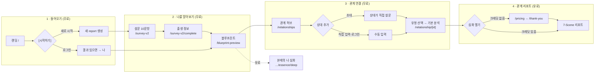

# 서비스 정보 구조도 (IA MAP) & 유저 플로우 — 단일 문서 (SSOT)

> **최종 갱신:** 2026-09-30 · **코드 기준:** `main` @ `aef5224`  
> **시각 버전 (KR/EN, 공유용):** [`docs/dev/service-map.html`](./service-map.html) — 브라우저로 열기  
> **이 문서가 IA·유저 플로우의 유일한 기준이에요.** 예전 문서는 `docs/dev/archive/`로 옮겼어요
> (`2026-07-08_IA_AND_USER_JOURNEY.md`, `2026-05_dev-flow-current.md`).  
> 화면(라우트)이 바뀌면 이 문서와 `service-map.html`을 같이 고쳐 주세요.

영어 사이트는 `/`, 한국어 사이트는 `/kr` 접두사예요. 화면 구조는 같아요 (자동 리다이렉트 없음).

---

## 0. 4개의 허브 (하단 도크·사이드 메뉴)

| 허브 | KR / EN 라벨 | URL | 역할 |
|------|--------------|-----|------|
| 홈 | 홈 / Home | `/` | 랜딩, [시작하기]. 로그인 + 결과 있으면 `나`로 자동 이동 |
| 나 | 나 / Me | `/blueprint-preview?reportId=` | 6축 무료 대시보드 → 유료 심화 리포트 |
| 관계 | 관계 / Lab | `/relationships?myReportId=` | 내 사람들 지도·목록, 초대·직접 입력, 관계 분석 시작 |
| 결정 | 결정 / Choice | `/decision` | 결정 저널 (기기 localStorage에만 저장) |

경로 헬퍼: `constants/routes.ts`, `lib/stitch/hubPaths.ts` (`blueprintPath`, `relationHubPath`, `resolveHubHrefForIntent`).

---

## 1. 정보 구조 (IA Tree)

범례: ● 핵심 · ○ 보조 · ✕ 정리 후보 · ⚙ 개발 전용(프로덕션 `notFound`)

```
Aha It's Me! (/  ·  /kr)
│
├── 시작 · 온보딩
│   ├── ● /                              랜딩 (히어로, 이용 방법, 샘플 리포트, 시작 모달)
│   ├── ● /survey-v2                     설문 10문항 (~2분)
│   ├── ● /survey-v2/complete            분석 오프닝 + 출생 정보 입력
│   ├── ○ /onboarding/birth              출생 정보 수정
│   └── ○ /onboarding/legal-consent      약관 동의
│
├── 나 (Blueprint)
│   └── ● /blueprint-preview             6축 대시보드 (지금의 나 vs 본래의 나)
│       ├── ○ …/[reportId]/current        지금의 나 상세 (Lite)
│       ├── ○ …/[reportId]/essence        본래의 나 상세 (Lite)
│       └── ● …/[reportId]/essence/deep   본래의 나 심화 리포트 (유료, Slim V1)
│
├── 관계
│   ├── ● /relationships                 관계 허브 (지도·목록·초대·직접 입력)
│   │   ├── ● /relationship/[id]          관계 리포트 (기본 → 7-Scene 유료)
│   │   └── ○ /relationship/share/[token] 공유 링크 뷰어
│   ├── ● /invite                        초대 링크 수신 → 랜딩으로
│   ├── ○ /invite-birth                  초대받은 사람 출생 정보
│   └── ✕ /connect                       개인 연결 링크 (/invite와 역할 겹침 — 결정 필요)
│
├── 결정
│   ├── ○ /decision                      결정 저널 쓰기
│   └── ○ /decision/history              내 결정 기록
│
├── 결제 · 계정
│   ├── ● /pricing                       구매 선택 (KR/US 지역별 가격, 환불 동의 후 결제)
│   │   └── ○ /thank-you                  결제 완료 → 3초 후 원래 화면
│   ├── ○ /redeem                        선물·테스터 코드 사용
│   ├── ○ /sign-in · /sign-up            Clerk
│   └── ○ /account                       계정
│       ├── ○ /account/profile            프로필·출생 정보
│       └── ○ /account/billing            결제 내역·크레딧
│
├── 소개 · 고객지원
│   ├── ○ /about
│   ├── ✕ /how-it-works                  랜딩 #how-it-works 섹션과 중복 (메뉴는 이미 섹션을 가리킴)
│   ├── ○ /faq
│   └── ○ /contact
│
├── 법적 고지
│   ├── ○ /terms  ○ /privacy  ○ /refund
│   └── ○ /do-not-sell                   (미국)
│
└── ⚙ 개발 전용 (/dev/*, 프로덕션 비노출)
    ├── relationship-enrichment-review · cohabitation-prescription · psych-capture
    └── romantic-v2-visual · romantic-v4-content-prototype · work-report-viewmodel
```

---

## 1.1 핵심 유저 플로우



관계 유형(`kind`): `romantic` 연인 · `friendship` 친구 · `work` 동료 · `family` 가족(`childIsViewer`, `parentType`) · `cohabitation` 동거·부부

## 1.2 초대 플로우

```
[나] 관계 허브 → 초대 링크 생성 (POST /api/invite/create)
  → [상대] /invite?token= → localStorage.inviteToken → /?token=
  → [상대] 시작하기 → 설문 10문항 → 출생 정보 → 블루프린트
  → [시스템] POST /api/invite/complete → relationship_reports 연결 (내 허브: 대기 → 연결됨, 폴링)
  → [둘 다] 관계 유형 선택 → 분석 시작
```

## 1.3 결제 · 크레딧 플로우

```
유료 리포트 열기 시도 (7-Scene 관계 리포트 / 본래의 나 심화)
  → 크레딧 부족 → /pricing (지역별 가격) → 환불 규정 동의 → 결제
  → /thank-you (?redirect= 로 3초 후 복귀) → 크레딧 차감 → 리포트 열림
선물·테스터 코드: /redeem 으로도 잠금 해제
```

결제사: 정식 결제사 선정 중. 그때까지 모든 사용자 테스트(샌드박스) 결제로 운영. 크레딧·결제 기록은 결제사 교체 후에도 유지.

## 1.4 화면별 진입 조건 (조건 불충족 시 되돌림)

| 화면 | 필요한 것 | 없으면 |
|------|-----------|--------|
| `/survey-v2` | reportId (시작하기로 생성) | `/` |
| `/survey-v2/complete` | 설문 10문항 완료 | `/survey-v2` |
| `/blueprint-preview` | 설문 완료 + 생년월일 (`hasResultsDashboardPrerequisites`) | `/survey-v2` · `/survey-v2/complete` |
| `/relationships` | 내 블루프린트 결과 (hubReportId) | 블루프린트 완료 안내 |
| 직접 입력 | 로그인 | 로그인 창 |
| 7-Scene 리포트 | 크레딧(premium) + 양쪽 생년월일·출생지 | 403 → 구매 화면 / 400 → 출생 정보 안내 |

출생 정보 규칙: 생년월일 필수 · 시간 모름 → 12:00으로 계산 · 출생지 모름 → 기본 분석은 가능, 7-Scene 심화는 양쪽 출생지 필수.

---

## 2. API 엔드포인트 지도 (52개 라우트)

| 영역 | 라우트 | 역할 |
|------|--------|------|
| **세션·홈** | `GET /api/home/resume` | 로그인 유저 리포트 세션 복원 & 랜딩 스킵 판별 |
| **설문·출생** | `GET/POST/DELETE /api/v2/survey` | v2 설문 응답 CRUD |
| | `POST /api/report/birth` | 생년월일·시간·출생지 저장 & 만세력 계산 |
| **개인 리포트** | `GET /api/v2/lite/current` | Current Self Lite LLM 리포트 |
| | `GET /api/v2/lite/essence` | Innate Self Lite LLM 리포트 |
| | `POST /api/v2/deep/essence` | Slim V1 심화 통합 리포트 (설문+사주+점성) |
| | `GET/POST /api/my/report` | 내 개인 리포트 조회/생성 |
| | `GET /api/saju` | 개인 사주 팔자 계산 데이터 |
| | `GET /api/astrology` | 출생지 기반 행성 점성 좌표 |
| **관계 7-Scene**| `GET/POST /api/relationship/list` | 관계 대상자 목록 및 요약 |
| | `POST /api/relationship/create` | 관계 생성 |
| | `POST /api/relationship/manual` | 상대방 직접 입력 생성 |
| | `GET /api/relationship/detail` | 관계 7-Scene 상세 조회 |
| | `POST /api/relationship/analyze/basic` | 관계 Basic 분석 |
| | `POST /api/relationship/analyze/premium` | 관계 7-Scene Premium 분석 (4대 도메인) |
| | `POST /api/relationship/upgrade` | 관계 리포트 업그레이드 |
| | `GET/POST /api/relationship/map` | 관계 지도 데이터 |
| | `GET /api/relationship/map/free-preview` | 관계 지도 프리뷰 |
| | `POST /api/relationship/share/create` | 공유 토큰 생성 |
| | `GET /api/relationship/share/view` | 공유 링크 결과 조회 |
| | `POST /api/relationship/share/revoke` | 공유 링크 취소 |
| | `GET /api/relationship/share/status` | 공유 상태 확인 |
| | `GET /api/relationship/share/inbox` | 받은 공유 함 |
| | `POST /api/relationship/favorite` | 즐겨찾기 |
| | `DELETE /api/relationship/remove` | 관계 삭제 |
| | `PATCH /api/relationship/partner-name` | 상대방 이름 수정 |
| | `POST /api/relationship/logs` | 관계 이벤트 로그 |
| | `POST /api/relationship/logs/batch` | 이벤트 로그 배치 |
| | `GET /api/relationship/status` | 관계 상태 |
| **초대** | `POST /api/invite/create` | 관계 초대 링크 생성 |
| | `GET /api/invite/info` | 초대 정보 확인 |
| | `POST /api/invite/accept` | 초대 수락 |
| | `POST /api/invite/complete` | 초대 완료 |
| | `POST /api/invite/cancel` | 초대 취소 |
| | `GET /api/invite/status` | 초대 상태 조회 |
| | `GET /api/invites/pending` | 대기 중 초대 목록 |
| **연결** | `POST /api/connect/link` | 리포트 연결 링크 |
| | `POST /api/connect/pending` | 연결 대기 |
| | `POST /api/connect/respond` | 연결 응답 |
| | `POST /api/connect/complete` | 연결 완료 |
| | `POST /api/connect/resolve` | 연결 해제 |
| | `POST /api/connect/reset` | 연결 리셋 |
| **계정·결제** | `PATCH /api/account/display-name` | 이름 변경 |
| | `DELETE /api/account/delete` | 회원 탈퇴 |
| | `POST /api/account/merge` | 게스트-계정 병합 |
| | `POST /api/beta/checkout/complete` | 결제 완료 처리 |
| | `POST /api/report/session-status` | 결제 세션 상태 |
| **진단·관리**| `GET /api/diag/supabase-connection` | DB 연결 진단 |
| | `POST /api/admin/rate-limit-reset` | 어드민 레이트리밋 리셋 |
| | `POST /api/llm` | 원시 LLM 호출 테스트 라우트 |

---

## 3. 데이터 저장소 및 세션 처리 SSOT

| 저장소 | 키 패턴 | 데이터 설명 |
|--------|---------|-------------|
| `sessionStorage` | `ahaitsme_v2_survey_*` | v2 10문항 설문 일시 응답 |
| `sessionStorage` | `ahaitsme_v2_birth_*` | 출생일시 및 출생지역 정보 |
| `sessionStorage` | `ahaitsme_v2_lite_*` | Lite 리포트 클라이언트 캐시 |
| `localStorage` | `reportId` | 최근 활성 리포트 ID (클라이언트 힌트용) |
| `localStorage` | `ahaitsme_decision_entries` | 의사결정 저널 (서버 미저장) |
| Supabase DB | `reports` 테이블 | 유저 온보딩/출생/사주 팔자 핵심 행 |
| Supabase DB | `relationship_reports` 테이블 | 관계 세션 및 7-Scene 분석 저장 |

---

## 4. 정리 및 폐기 (Cleaned Up & Deprecated)

1. **레거시 18문항 라우트 (`app/survey`)**: `app/` 라우트에서 완전 삭제됨.
2. **구버전 v2 deep (`lib/v2/deep`)**: 폐기 완료 (`decisions/003`에 따라 `lib/v1/slim`으로 전면 통합).
3. **일회성 디버그 스크립트**: `scratch/` 디렉토리는 일회성 검증 전용이며 프로덕션 번들에 절대 포함되지 않음.

## 5. 남은 정리 후보 (2026-09-30 기준, 아직 삭제 안 함)

| 순서 | 항목 | 메모 |
|------|------|------|
| 다음 | `/how-it-works` 별도 페이지 | 랜딩 `#how-it-works` 섹션으로 리다이렉트 검토 |
| 다음 | `/connect` vs `/invite` | 개인 연결 링크 유지 여부 결정 필요 |
| 다음 | 루트 폴더 | `test-saju.js`, `*_GOLDEN_BASELINE.md`, `ROMANTIC_HEADLINE_EN.md` 등 → `docs/`·`tests/`, `scratch/` 정리 |
| 나중 | `/dev/*` 6개 | 끝난 실험(연인 v2·v4 시안 등)만 삭제 |
| 나중 | 기존 결제 연동 코드 | 테스트 결제가 사용 중 — 새 결제사 확정 후 교체, 크레딧 데이터 유지 |
