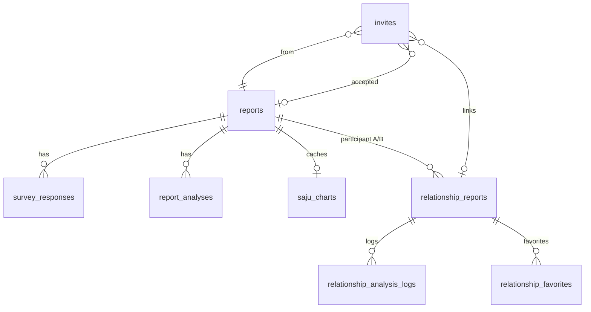

# 데이터셋 규격서 (DB 스키마 & 로컬 캐시)

> **작성일:** 2026-07-08  
> **코드 기준:** `main` @ `267170e`  
> **출처:** `supabase/migrations/`, `lib/` TypeScript 타입, API insert/select 필드  
> **주의:** `reports`, `survey_responses`, `invites`, `saju_charts`의 CREATE TABLE은 마이그레이션에 없음 — 코드·운영 DB에서 역추론

---

## 1. 데이터 계층 개요

```
┌─────────────────────────────────────────────────────────────┐
│  Supabase (영구 SSOT)                                       │
│  reports → survey_responses, report_analyses, saju_charts     │
│         → relationship_reports → logs, favorites            │
│  invites (초대 → relationship_report_id 연결)               │
└─────────────────────────────────────────────────────────────┘
         ▲ API routes (service role)
         │
┌─────────────────────────────────────────────────────────────┐
│  localStorage (진행 중·캐시·게스트 UX)                        │
│  reportId, inviteToken, ahaitsme_v2_survey_{id}, ...        │
└─────────────────────────────────────────────────────────────┘
```

**Premium 판별 (개인):** `reports.payment_status === "paid"` 또는 `plan_type === "paid"`  
**Premium 판별 (관계):** `relationship_reports.analysis_type === "premium"`

---

## 2. `reports` — 사용자·리포트 마스터

| 데이터 항목 (영문 / 한글) | 설명 | 필수 | 타입 |
|---------------------------|------|:----:|------|
| `id` / 리포트 ID | 전역 SSOT UUID (PK) | ✅ | `uuid` |
| `name` / 이름 | 사용자 또는 수동 입력 파트너 이름 | ❌ | `text` |
| `clerk_user_id` / Clerk 사용자 ID | 로그인 계정 귀속 (게스트는 null) | ❌ | `text` |
| `birth_date` / 생년월일 | YYYY-MM-DD | ❌* | `text` / `date` |
| `birth_time` / 출생 시각 | HH:MM (null = 시간 모름 → 12:00 계산) | ❌ | `text` |
| `birth_place` / 출생지 | 자유 텍스트 (도시·국가) | ❌ | `text` |
| `birth_latitude` / 출생 위도 | 점성·좌표 계산용 | ❌ | `double precision` |
| `birth_longitude` / 출생 경도 | 점성·좌표 계산용 | ❌ | `double precision` |
| `birth_timezone` / UTC 오프셋 | 예: 9 = KST | ❌ | `real` |
| `report_type` / 리포트 종류 | `self`, `relationship`, `partner_manual` | ✅ | `text` |
| `plan_type` / 요금제 | `free`, `paid` | ✅ | `text` |
| `payment_status` / 결제 상태 | `none`, `paid` | ✅ | `text` |
| `created_at` / 생성 시각 | | ✅ | `timestamptz` |

\* Blueprint·기본 분석 관문에서는 `birth_date`가 사실상 필수. DB 제약은 nullable.

**Unknown fallback 정책 (코드 상수):**
- 시간 모름(`birth_time = null`) → `12:00`
- 장소 모름(`birth_place` 비거나 unknown) → `San Francisco, CA`
- 기본 좌표 → `37.7749`, `-122.4194`, timezone `-8`

**TypeScript 참조:** `CanonicalReportRow` (`lib/home/resolveCanonicalReport.ts`), `ReportBirthRow` (`lib/v2/onboarding/resolveReportBirth.ts`)

---

## 3. `survey_responses` — v2 설문 응답

| 데이터 항목 (영문 / 한글) | 설명 | 필수 | 타입 |
|---------------------------|------|:----:|------|
| `id` / 응답 행 ID | PK | ✅ | `uuid` |
| `report_id` / 리포트 FK | `reports.id` | ✅ | `uuid` |
| `answers` / 설문 JSON | v2 10문항 + 프로필 | ✅ | `jsonb` |

### `answers` JSON 내부 필드

| 항목 (영문 / 한글) | 설명 | 필수 | 타입 |
|--------------------|------|:----:|------|
| `q1` … `q9` / 1~9번 응답 | A~D 선택 | v2 완료 시 ✅ | `string` |
| `q10` / 10번 응답 | 1~5 척도 | v2 완료 시 ✅ | `string` |
| `survey_source` / 설문 버전 | v2: `"v2_10q"` | v2 시 ✅ | `string` |
| `v2_profile` / 점수화 프로필 | `CurrentSelfProfile` 객체 | v2 시 ✅ | `object` |
| `survey_skipped` / 설문 스킵 | 수동 파트너 중립 프로필 시 | ❌ | `boolean` |

### `CurrentSelfProfile` (`lib/v2/survey/types.ts`)

| 항목 | 설명 | 타입 |
|------|------|------|
| `profile_type` | 프로필 유형 라벨 | `string` |
| `primary_axes` | 주요 6축 점수 | `object` |
| `secondary_axes` | 보조 축 | `object` |
| `personalization.primary_concern` | 주요 관심사 | `string` |
| `meta.survey_version` | 설문 버전 | `string` |
| `meta.completed_at` | 완료 시각 | `string` |
| `meta.completion_time_seconds` | 소요 시간 | `number` |

---

## 4. `report_analyses` — 개인 LLM 분석 캐시

| 데이터 항목 (영문 / 한글) | 설명 | 필수 | 타입 |
|---------------------------|------|:----:|------|
| `id` / 분석 행 ID | PK | ✅ | `uuid` |
| `report_id` / 리포트 FK | | ✅ | `uuid` |
| `analysis_type` / 분석 종류 | 아래 enum | ✅ | `text` |
| `content` / LLM 본문 | 생성 텍스트 | ✅ | `text` |
| `metadata` / 메타데이터 | 모델명, fingerprint 등 | ❌ | `jsonb` |
| `created_at` / 생성 | | ✅ | `timestamptz` |
| `updated_at` / 수정 | | ✅ | `timestamptz` |

**`analysis_type` 허용값:** `basic` | `premium` | `integrated` | `relationship` | `detailed_survey` | `astrology`  
**유니크:** `(report_id, analysis_type)` 1행

**TypeScript:** `ReportAnalysisRow`, `ReportAnalysisType` (`lib/report/reportAnalyses.ts`)

---

## 5. `relationship_reports` — 관계 분석 (2인 쌍)

| 데이터 항목 (영문 / 한글) | 설명 | 필수 | 타입 |
|---------------------------|------|:----:|------|
| `id` / 관계 분석 ID | PK | ✅ | `uuid` |
| `report_id_a` / 참여자 A | `reports.id` (A ≠ B) | ✅ | `uuid` |
| `report_id_b` / 참여자 B | `reports.id` | ✅ | `uuid` |
| `analysis_type` / 분석 등급 | `basic` \| `premium` | ✅ | `text` |
| `result_basic` / 기본 분석 JSON | 4축 perspectives (LLM) | ❌ | `jsonb` |
| `result_premium` / 레거시 심화 JSON | 폴백용 | ❌ | `jsonb` |
| `result_premium_by_kind` / 유형별 심화 캐시 | kind별 저장 (기본 `{}`) | ✅ | `jsonb` |
| `relationship_kind` / 기본 관계 유형 | romantic/family/work/friendship/cohabitation | ✅ | `text` |
| `created_at` / 생성 | | ✅ | `timestamptz` |
| `updated_at` / 수정 | | ✅ | `timestamptz` |

**유니크:** `least(report_id_a, report_id_b), greatest(...)` — 순서 무관 동일 쌍 1행

### `result_basic` JSON 구조

| 항목 | 설명 | 타입 |
|------|------|------|
| `perspectives` | `Record<reportId, Perspective>` | `object` |
| `Perspective.emotional_sensitivity` | 감정 민감도 축 | 축 객체 |
| `Perspective.communication_style` | 소통 스타일 | 축 객체 |
| `Perspective.conflict_response` | 갈등 반응 | 축 객체 |
| `Perspective.energy_pattern` | 에너지 패턴 | 축 객체 |

각 축: `my_line`, `partner_line`, `insights[]`, `actions[]`

### `result_premium_by_kind` JSON

`Partial<Record<RelationshipKind, PremiumKindPayload>>`

| kind | 완료 판정 키 (예) |
|------|------------------|
| `romantic` | `section_1_summary` |
| `work` | `snapshot_panel` |
| `cohabitation` | `snapshot_panel` |
| `family` | `family.section_child_dna` |
| `friendship` | `friend.section_social_dna_a` |

**TypeScript:** `RelationshipReportRow`, `ResultPremiumByKind` (`lib/relationship/premiumByKind.ts`)

---

## 6. `invites` — 관계 초대

| 데이터 항목 (영문 / 한글) | 설명 | 필수 | 타입 |
|---------------------------|------|:----:|------|
| `id` / 초대 ID | PK | ✅ | `uuid` |
| `from_report_id` / 발신 리포트 | 초대한 사람 `reports.id` | ✅ | `uuid` |
| `invite_token` / 초대 토큰 | URL `?token=` 값 | ✅ | `text` |
| `invite_type` / 초대 유형 | `relationship` | ✅ | `text` |
| `status` / 상태 | `open`, `complete` | ✅ | `text` |
| `accepted_report_id` / 수락 리포트 | 수락자 `reports.id` | ❌ | `uuid` |
| `relationship_report_id` / 연결된 관계 분석 | `relationship_reports.id` | ❌ | `uuid` |
| `created_at` / 생성 | | ✅ | `timestamptz` |

---

## 7. `relationship_analysis_logs` — 관계 분석 이력

| 데이터 항목 (영문 / 한글) | 설명 | 필수 | 타입 |
|---------------------------|------|:----:|------|
| `id` / 로그 ID | PK | ✅ | `uuid` |
| `relationship_report_id` / 관계 분석 FK | | ✅ | `uuid` |
| `viewer_report_id` / 조회자 리포트 | | ✅ | `uuid` |
| `relationship_kind` / 관계 유형 | + `unspecified` | ✅ | `text` |
| `analysis_level` / 등급 | `basic` \| `premium` | ✅ | `text` |
| `result_format` / 결과 포맷 ID | | ✅ | `text` |
| `result_snapshot` / 결과 스냅샷 | 재생성 전 보존 JSON | ✅ | `jsonb` |
| `created_at` / 생성 | | ✅ | `timestamptz` |

---

## 8. `relationship_favorites` — 관계 즐겨찾기

| 데이터 항목 (영문 / 한글) | 설명 | 필수 | 타입 |
|---------------------------|------|:----:|------|
| `viewer_report_id` / 조회자 | 복합 PK | ✅ | `uuid` |
| `relationship_report_id` / 관계 분석 | 복합 PK | ✅ | `uuid` |
| `created_at` / 생성 | | ✅ | `timestamptz` |

---

## 9. `saju_charts` — 사주 팔자 저장 (선택)

| 데이터 항목 (영문 / 한글) | 설명 | 필수 | 타입 |
|---------------------------|------|:----:|------|
| `report_id` / 리포트 FK | | ✅ | `uuid` |
| `year_pillar` / 년주 | | ✅ | `text` |
| `month_pillar` / 월주 | | ✅ | `text` |
| `day_pillar` / 일주 | | ✅ | `text` |
| `hour_pillar` / 시주 | | ✅ | `text` |

> 런타임은 주로 `calculateSajuBundle` 재계산. DB는 선택적 캐시.

---

## 10. localStorage 규격 (DB 보조)

### 10.1 글로벌 키

| 키 | 한글 | 저장 내용 | 타입 |
|----|------|-----------|------|
| `reportId` | 현재 리포트 힌트 | UUID 문자열 | `string` |
| `inviteToken` | 관계 초대 토큰 | 토큰 문자열 | `string` |
| `ahaitsme_relation_hub_banner_dismissed` | 허브 배너 닫음 | `"1"` | `string` |

### 10.2 reportId별 키 (`{id}` = `reports.id`)

| 키 패턴 | 한글 | 저장 필드 | 타입 |
|---------|------|-----------|------|
| `ahaitsme_v2_survey_{id}` | v2 설문 진행 | `answers`, `profile`, `savedAt` | JSON |
| `ahaitsme_v2_birth_{id}` | 출생 입력 캐시 | `birthDate`, `birthTime`, `birthTimeUnknown`, `birthPlace`, `birthPlaceUnknown?`, `savedAt` | JSON |
| `ahaitsme_v2_lite_current_{id}` | Current Lite | `CurrentSelfLiteReport` 전체 | JSON |
| `ahaitsme_v2_lite_innate_{id}` | Innate Lite | `InnateSelfLiteReport` 전체 | JSON |
| `ahaitsme_v2_slim_integrated_{id}` | Deep 심화 캐시 | `slim_v1.report` 등 | JSON |
| `ahaitsme_decisions_{id}` | 결정 저널 | `DecisionEntry[]` | JSON |
| `ahaitsme_partner_display_{rrId}` | 파트너 표시명 | 최대 10자 | `string` |

### 10.3 BirthV2Session 필드 (`lib/v2/onboarding/birthSession.ts`)

| 필드 | 한글 | 필수 (폼) | 타입 |
|------|------|:---------:|------|
| `birthDate` | 생년월일 | ✅ | `string` |
| `birthTime` | 출생 시각 | 조건부 | `string \| null` |
| `birthTimeUnknown` | 시간 모름 | — | `boolean` |
| `birthPlace` | 출생지 | 조건부 | `string` |
| `birthPlaceUnknown` | 장소 모름 | — | `boolean` |
| `savedAt` | 저장 시각 | — | `string` |

> `birthPlaceUnknown=true`로 저장된 경우 서버 저장 시 `birth_place`는 `San Francisco, CA`로 정규화된다.

---

## 11. 엔티티 관계 (ER 요약)



---

## 12. 마이그레이션 파일 목록

| 파일 | 내용 |
|------|------|
| `20260408120000_add_birth_place_to_reports.sql` | `reports.birth_place` |
| `20260420120000_relationship_reports.sql` | `relationship_reports` CREATE |
| `20260510225000_add_clerk_user_id_to_reports.sql` | `clerk_user_id` |
| `20260516130000_report_analyses.sql` | `report_analyses` CREATE |
| `20260518120000_report_analyses_detailed_survey.sql` | +`detailed_survey` |
| `20260518140000_report_analyses_astrology.sql` | +`astrology` |
| `20260518150000_reports_birth_coordinates.sql` | lat/lon/timezone |
| `20260519120000_enable_rls_remediation.sql` | RLS |
| `20260628120000_relationship_kind_premium_by_kind.sql` | kind + by_kind |
| `20260628140000_relationship_logs_favorites.sql` | logs + favorites |
| `20260705165000_relationship_kind_cohabitation.sql` | +cohabitation |

---

## 13. TypeScript 타입 맵 (`types/` 폴더 없음 — `lib/` 수동 정의)

| 테이블 | 주요 타입 | 파일 |
|--------|-----------|------|
| `reports` | `CanonicalReportRow`, `ReportBirthRow` | `lib/home/`, `lib/v2/onboarding/` |
| `survey_responses` | `CurrentSelfProfile`, `SurveyV2SessionBundle` | `lib/v2/survey/` |
| `relationship_reports` | `RelationshipReportRow`, `PremiumKindPayload` | `lib/relationship/` |
| `report_analyses` | `ReportAnalysisRow` | `lib/report/reportAnalyses.ts` |
| `relationship_analysis_logs` | `AnalysisLogRow` | `lib/relationship/analysisLog.ts` |
| 세션 통합 | `ReportSession` | `lib/home/reportSession.ts` |

> Supabase codegen `Database` / `TablesInsert` / `Row<>` 자동 타입은 **미사용**.

---

*갱신 시: 마이그레이션 추가·API 필드 변경 시 해당 테이블 섹션을 우선 업데이트할 것.*

---

## 14. 출생 정보 수정 정책 (어뷰징 방지)

### 14.1 `/account/profile` UI 정책

- 생년월일(`birth_date`): 최초 입력 후 잠금(Disabled + 🔒 안내)
  - 안내 문구: `생년월일 변경은 고객센터로 문의해 주세요.`
- 출생 시간(`birth_time`), 출생지(`birth_place`): 수정 허용

### 14.2 저장 후 캐시 무효화

- 계정 저장 완료 시 즉시 무효화:
  - `clearLiteReports(reportId)`
  - `clearSlimIntegratedCache(reportId)`
  - `invalidateReportSession(reportId)`
- 서버 저장 API(`POST /api/report/birth`)는 점성 분석 캐시(`analysis_type=astrology`) 삭제 후 재조회 경로 유도
