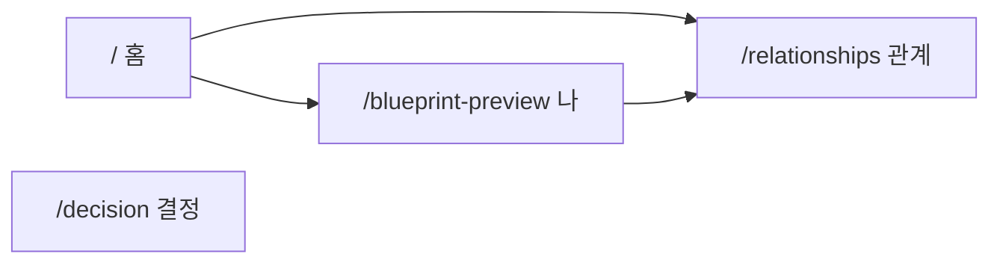

# WhoamI 개발자 핸드북 (Stitch 기준)

> **작성일:** 2026-07-08  
> **브랜치 기준:** `main` @ `7db70e0`  
> **목적:** 유저 플로우·IA·DB·참조 파일을 한곳에 모아, 로직 꼬임 방지용 SSOT  
> **기존 문서:** `docs/v2/PRD/00_Master_PRD.md`, `docs/v2/guide/01_Core_User_Flow.md`, `docs/dev-flow-current.md` 와 **병행** — 이 문서는 **현재 구현(Stitch UI)** 에 맞춘 실전판

---

## 0. 한 줄 요약

| 층 | 역할 |
|----|------|
| **UI (Stitch)** | 랜딩 → 설문 → 출생 → Blueprint / 관계 허브 / 결정 저널 |
| **localStorage** | 진행 중 UX 가속 (`reportId`, 설문·출생 세션, Lite 캐시) |
| **Supabase** | 영구 SSOT (`reports`, `survey_responses`, 관계·분석·초대) |
| **LLM** | Lite 요약·관계 4축·심화 리포트 (규칙+프롬프트) |
| **만세력** | `@fullstackfamily/manseryeok` (KASI) + `lib/hardcoded/sajuReferenceData` |

---

## 1. 정보 구조 (IA)

### 1.1 4대 허브



| 허브 | URL | 쿼리 | 역할 |
|------|-----|------|------|
| 홈 | `/` | `?token=` (초대) | 랜딩, 시작하기, 로그인 모달 |
| 나 (Blueprint) | `/blueprint-preview` | `?reportId=` | 6축 무료 대시보드, Lite/Deep 진입 |
| 관계 | `/relationships` | `?myReportId=`, `?section=add` | 친구·초대·관계 분석 허브 |
| 결정 | `/decision` | — | 의사결정 저널 (localStorage) |

**경로 헬퍼:** `lib/stitch/hubPaths.ts`
- `blueprintPath(reportId?)` → `/blueprint-preview?reportId=...`
- `relationHubPath(reportId?)` → `/relationships?myReportId=...`
- `readStoredReportId()` → `localStorage.reportId`

### 1.2 온보딩·분석 서브 라우트

| URL | 파일 | 역할 |
|-----|------|------|
| `/survey-v2` | `app/survey-v2/page.tsx` | 설문 10문항 |
| `/survey-v2/complete` | `app/survey-v2/complete/page.tsx` | 출생 정보 + 결과 보기 |
| `/onboarding/birth` | `app/onboarding/birth/page.tsx` | 출생 정보 독립 편집 |
| `/blueprint-preview/[id]/current` | innate/current Lite | Current Self 상세 |
| `/blueprint-preview/[id]/innate` | innate Lite | Innate Self 상세 |
| `/blueprint-preview/[id]/innate/deep` | Slim V1 심화 | 유료 Deep |
| `/relationship/[id]` | 관계 분석 상세 | basic/premium 4축·심화 |

### 1.3 전역 크롬 (모든 페이지 공통)

```
app/layout.tsx
  └── ConditionalAppChrome
        └── StitchAppChrome
              ├── StitchFixedHeader   (z-200)
              ├── {children}
              ├── StitchAppFooter     (/ 제외)
              └── StitchScrollDock    (스크롤 시 표시)
```

- **주의:** `/sign-in`, `/survey-v2` 등도 헤더·도크가 겹침 → z-index·하단 패딩(`pb-[calc(5.75rem+...)]`) 설계 시 고려
- **로그인:** 홈(`/`)만 커스텀 모달 (`authBridge`); 그 외 Clerk `openSignIn`
- **도크 활성:** `stitchDockActivePath()` — `/survey-v2` 등은 어떤 탭도 활성 아님

### 1.4 마케팅·법적

`/about`, `/pricing`, `/faq`, `/how-it-works`, `/contact`, `/terms`, `/privacy`, `/refund`, `/account`

---

## 2. 유저 플로우 (의도 SSOT)

### 2.1 신규 게스트 — 정본 순서

```
랜딩 [시작하기]
  → StartChoiceModal
      ├─ "시작하기 (무료 설문)" → 새 reports 행 생성 → /survey-v2
      └─ "로그인" → 커스텀 auth 모달
  → 설문 10문항 (/survey-v2)
  → 출생 정보 + [결과 보기] (/survey-v2/complete)
  → Blueprint (/blueprint-preview?reportId=)
  → (비로그인) GuestDashboardAuthNotice — 저장 안 됨 경고
```

**관문 함수:** `lib/v2/results/canShowResultsDashboard.ts`
- 설문 완료 (`surveyCompleted` 또는 `hasSurveyV2Session`)
- 출생 최소 (`birthDate` DB 또는 `hasBirthV2Session`)

### 2.2 로그인 사용자 — 홈 자동 리다이렉트

`app/homecontent.tsx` — 로그인 + 설문·출생 완료 시:
→ `router.replace(/blueprint-preview?reportId=...)` (랜딩 스킵)

### 2.3 재방문 게스트 — 현재 구현 주의

| 항목 | 의도 (PRD) | 현재 Stitch 구현 |
|------|-----------|-----------------|
| 랜딩 CTA | 이어하기 분기 | **`시작하기`만** (`StitchHomeCta.tsx`) |
| 시작하기 클릭 | — | **항상 새 report 생성** (`startFreeSurvey`) |
| 이전 진행 복구 | Blueprint/설문 이어하기 | URL 직접, 푸터·도크, `/api/home/resume` |

**레거시 재개 UI:** `components/home/HomeAuthActions.tsx` (Stitch 랜딩 **미사용**)

→ **로직 꼬임 1순위 원인:** PRD·레거시·Stitch CTA 세 갈래가 공존

### 2.4 관계 허브

```
/relationships?myReportId={reportId}
  → GET /api/relationship/list
  → 친구 선택 → 관계 종류 → /relationship/{rrId}?viewer=&kind=&autostart=1
```

**게이트:** `hubReportId` 없으면 Blueprint 완료 안내  
**친구 추가:** 초대 링크 (`POST /api/invite/create`) / 직접 입력 (`POST /api/relationship/manual`) — **로그인 필요**  
**폴링:** `outbound_waiting` 있을 때만 22초 간격 (`RelationHubDashboard.tsx`)

### 2.5 초대 수락 플로우

```
/invite?token= → localStorage.inviteToken → /?token=
  → 시작하기 → report_type: "relationship" 리포트 생성 → 설문 플로우
```

---

## 3. 로직 꼬임 방지 — 변경 시 체크리스트

| # | 규칙 | 이유 |
|---|------|------|
| 1 | **랜딩 `시작하기`는 설문 진입만** — Blueprint/complete 직행 금지 | 온보딩 순서 깨짐 |
| 2 | **`startFreeSurvey`는 새 report만** — localStorage 이어하기 넣지 말 것 | 출생 화면으로 점프 |
| 3 | **`/survey-v2` → complete 리다이렉트는 10문항 완료 시만** | `isSurveyV2AnswersComplete` |
| 4 | **`authBridge` 핸들러는 `() => setOpen(true)`** — 이중 화살표 금지 | 로그인 버튼 무반응 |
| 5 | **관계 허브: `skipSessionHydrate: true`** | home/resume + hydrate 중복 |
| 6 | **canonical `reportId`는 한 경로로** — `useCanonicalReportId` / `resolveCanonicalReportIdClient` | 이중 API |
| 7 | **게스트 `reports.clerk_user_id IS NULL`만 resume** | `lib/home/homeResume.ts` |
| 8 | **하단 fixed CTA는 도크(z~100)와 겹침** — `survey-v2/complete`는 인라인 버튼 | 클릭 불가 |

---

## 4. DB 연결 현황

### 4.1 앱이 사용하는 Supabase 테이블 (코드 기준 ✅)

| 테이블 | 용도 | 주요 API/lib |
|--------|------|--------------|
| `reports` | 리포트·출생 SSOT | `/api/report/birth`, `/api/home/resume`, `lib/report/*` |
| `survey_responses` | v2 설문 영구 저장 | `/api/v2/survey`, `lib/v2/survey/dbCompletion.ts` |
| `report_analyses` | 개인 LLM 분석 캐시 | `/api/my/report`, `lib/report/reportAnalyses.ts` |
| `report_results` | 레거시 basic (폴백 읽기) | `lib/report/reportAnalyses.ts` |
| `saju_charts` | 사주 팔자 저장 (선택) | `/api/saju` |
| `invites` | 친구 초대 | `/api/invite/*`, `relationship/list` |
| `relationship_reports` | 관계 분석 행 | `/api/relationship/*` |
| `relationship_analysis_logs` | 관계 분석 이력 | `lib/relationship/analysisLog.ts` |
| `relationship_favorites` | 관계 즐겨찾기 | `/api/relationship/favorite` |

**마이그레이션:** `supabase/migrations/` 11개 — 스키마 정의됨  
**RLS:** `20260519120000_enable_rls_remediation.sql`  
**서버 접근:** `SUPABASE_SERVICE_ROLE_KEY` (API routes), 클라이언트는 anon + RLS

### 4.2 DB가 아닌 참조 데이터 (✅ 코드 내장)

| 데이터 | 위치 | 비고 |
|--------|------|------|
| 사주 천간·지지·십성·12운성·합충·신살 | `lib/hardcoded/sajuReferenceData` | Supabase `ref_*` 미사용 (프로덕션) |
| 만세력 계산 | `@fullstackfamily/manseryeok` | KASI 기반, `app/api/saju/route.ts` |
| 설문 10문항 | `lib/v2/survey/questions.ts` | |
| 설문 패턴 해석 (관계 basic) | DB `pattern_base` (관계 설문 18문항 경로) | v2 10문항과 별도 |

### 4.3 localStorage / sessionStorage (DB 보조)

| 키 패턴 | 용도 | lib |
|---------|------|-----|
| `reportId` | 현재 탐사 ID 힌트 | `hubPaths.ts`, `homecontent.tsx` |
| `inviteToken` | 관계 초대 | `survey-v2`, `invite` |
| `ahaitsme_v2_survey_{id}` | 설문 진행 | `lib/v2/survey/session.ts` |
| `ahaitsme_v2_birth_{id}` | 출생 캐시 | `lib/v2/onboarding/birthSession.ts` |
| `ahaitsme_decisions_{id}` | 결정 저널 | `lib/decision/session.ts` |

**SSOT 원칙:** 영구 저장은 DB. localStorage는 **진행 중·캐시·게스트 UX** 용.

### 4.4 환경 변수 (필수)

| 변수 | 용도 |
|------|------|
| `NEXT_PUBLIC_SUPABASE_URL` | Supabase |
| `NEXT_PUBLIC_SUPABASE_ANON_KEY` | 클라이언트 |
| `SUPABASE_SERVICE_ROLE_KEY` | API 서버 |
| Clerk keys | `AppClerkProvider` |

로컬: `.env.local` — dev 서버 `Environments: .env.local` 로드 확인

### 4.5 DB 연결 검증 (개발자 로컬)

```powershell
# .env.local 설정 후
node -e "(async()=>{require('dotenv').config({path:'.env.local'});const {createClient}=require('@supabase/supabase-js');const sb=createClient(process.env.NEXT_PUBLIC_SUPABASE_URL,process.env.SUPABASE_SERVICE_ROLE_KEY);for(const t of ['reports','survey_responses','relationship_reports','invites']){const {count,error}=await sb.from(t).select('*',{count:'exact',head:true});console.log(t,error?'ERR':'OK',count??'');}})()"
```

---

## 5. API 맵 (30 routes)

### 개인·온보딩

| API | DB |
|-----|-----|
| `GET /api/home/resume` | ✅ reports, survey_responses, invites |
| `GET/POST/DELETE /api/v2/survey` | ✅ survey_responses |
| `GET/POST /api/report/birth` | ✅ reports |
| `GET/POST /api/my/report` | ✅ report_analyses |
| `POST /api/saju` | ✅ saju_charts (선택) |
| `POST /api/astrology` | ❌ 계산+LLM only |
| `POST /api/v2/lite/current`, `innate` | ❌ stateless LLM |
| `POST /api/v2/deep/innate` | 검증만 DB |

### 관계

| API | DB |
|-----|-----|
| `GET /api/relationship/list` | ✅ relationship_*, invites, reports, favorites |
| `POST /api/relationship/analyze/basic` | ✅ relationship_reports (LLM → result_basic) |
| `POST /api/relationship/analyze/premium` | ✅ result_premium, result_premium_by_kind |
| `POST /api/invite/create`, `accept`, `complete`, `cancel` | ✅ invites |
| `POST /api/relationship/manual` | ✅ reports (proxy) + relationship_reports |

---

## 6. 분석 엔진·프롬프트 참조

### 6.1 개인 분석

| 단계 | 엔진 | 프롬프트/코드 |
|------|------|---------------|
| 설문 점수 | deterministic | `lib/v2/survey/scorer.ts` |
| Innate 6축 | deterministic | `lib/v2/saju/innateLite.ts` |
| Gap | deterministic | `docs/v2/analysis/01_Gap_Analysis_Rules.md` |
| Lite 문장 | LLM | `lib/prompts` 01·02, `/api/v2/lite/*` |
| Deep 통합 | LLM 2-phase | `lib/prompts/integratedPremiumReport.ts`, `/api/llm` mode `integrated` |
| 사주 구조화 | 규칙+hardcoded | `/api/saju`, `lib/saju/*` |

### 6.2 관계 분석

| 단계 | 내용 | 파일 |
|------|------|------|
| Basic 4축 | 설문 패턴만, LLM JSON | `lib/prompts/relationshipAnalysis.ts` → `buildRelationshipBasicPrompt` |
| Premium extra | + 사주·점성 짧은 요약 | `buildRelationshipPremiumExtraBlock` |
| Premium by kind | romantic, family, work, cohabitation, friendship | `lib/prompts/relationshipPremium/*` |
| 사주 원국 룰 | 합충·십성 (1인) | `ref_relation_rules` 등 → **hardcoded** in prod |

**주의:** 사람 간 사주 궁합 룰 DB **없음** — premium은 LLM에 짧은 사주 요약만 전달

### 6.3 문서 교차 참조

| 주제 | 문서 |
|------|------|
| 제품 비전·MVP | `docs/v2/PRD/00_Master_PRD.md` |
| 이상적 유저 플로우 | `docs/v2/guide/01_Core_User_Flow.md` |
| 레거시 리포트 파이프라인 | `docs/dev-flow-current.md` |
| 설문 정본 | `docs/v2/survey/02_Survey_Questions.md` |
| 사주 스키마 | `docs/v2/saju/02_Saju_Input_Schema.md` |
| 관계 아키텍처 | `docs/v2/relationship/01_Relationship_Architecture.md` |
| 프롬프트 구조 | `docs/v2/prompt/00_Prompt_Architecture.md` |
| 개발 상태 | `docs/dev/00_Status.md` |

---

## 7. 핵심 구현 파일 맵

### 7.1 온보딩

| 파일 | 역할 |
|------|------|
| `app/homecontent.tsx` | 홈 오케스트레이션, report 생성, auth 모달, resume |
| `components/landing/stitch/StitchHomeCta.tsx` | 랜딩 CTA (시작하기 + how it works) |
| `components/landing/stitch/StartChoiceModal.tsx` | 설문/로그인 선택 |
| `app/survey-v2/page.tsx` | 10문항 UI |
| `app/survey-v2/complete/page.tsx` | 출생 + 결과 보기 |
| `components/onboarding/StitchBirthInputForm.tsx` | 출생 폼 |
| `components/results/StitchResultsDashboard.tsx` | Blueprint 대시보드 |
| `components/results/GuestDashboardAuthNotice.tsx` | 게스트 저장 경고 |

### 7.2 인증

| 파일 | 역할 |
|------|------|
| `lib/stitch/authBridge.ts` | 홈 ↔ 헤더 로그인 연결 |
| `components/layout/stitch/StitchFixedHeader.tsx` | 우상단 로그인 |
| `components/clerk/AppClerkProvider.tsx` | Clerk 설정 |
| `components/home/HomeAuthSignInPanel.tsx` | 홈 커스텀 SignIn |

### 7.3 관계 허브

| 파일 | 역할 |
|------|------|
| `components/relationship/hub/RelationHubDashboard.tsx` | 허브 메인 |
| `app/api/relationship/list/route.ts` | 목록 API |
| `lib/relationship/fetchReportsWhereParticipant.ts` | 관계 행 조회·병합 |
| `app/relationship/[id]/RelationshipView.tsx` | 분석 상세 |

### 7.4 reportId·resume

| 파일 | 역할 |
|------|------|
| `lib/home/resolveCanonicalReportIdClient.ts` | 클라이언트 canonical |
| `lib/home/useCanonicalReportId.ts` | React hook |
| `lib/home/fetchHomeResumeClient.ts` | resume API (12s TTL 캐시) |
| `lib/home/homeResume.ts` | 서버 resume 빌드 |
| `lib/v2/report/hydrateReportSessions.ts` | 설문·출생 local 복구 |

---

## 8. PRD 요약 (개발자용)

### 8.1 제품 목표

AI 기반 **자기 이해 → 더 나은 결정**. 점술 예언이 아니라 Current Self(설문) + Innate Self(사주 참조) + Gap + 관계 + 결정 저널.

### 8.2 무료 MVP 범위

- v2 설문 10문항 + 출생 입력
- Blueprint 6축 레이더 (Current vs Innate, delta)
- Lite 텍스트 (로그인 후)
- 관계 basic 4축 (설문 기반, 2인)
- 게스트 허용, **로그인 시 계정에 귀속**

### 8.3 유료 (부분 구현)

- Deep integrated self report (`/innate/deep`)
- Relationship premium (유형별 심화)
- Pricing UI (`/pricing`) — 결제 플로우는 `relationship/upgrade` 등

### 8.4 비목표 / 미구현

- 사람 간 사주 궁합 결정론 엔진
- Decision AI LLM (저널 UI만)
- FAQ, how-it-works 콘텐츠 (플레이스홀더)

---

## 9. 최근 수정 이력 (2026-07-08)

커밋 `7db70e0`:
- 관계 허브 UI 블로킹 해제, `skipSessionHydrate`, resume 캐시, 조건부 폴링
- `relationship/list` 병렬·batch 쿼리
- 랜딩 CTA 단순화, 온보딩 순서 복구, authBridge 수정
- `survey-v2/complete` 결과 보기 버튼 인라인화

---

## 10. 신규 개발자 온보딩 순서

1. 이 문서 + `docs/v2/guide/01_Core_User_Flow.md` 읽기
2. `.env.local` 설정 후 `npm run dev` → 시크릿 창으로 게스트 플로우 1회
3. Network 탭: `/api/home/resume`, `/api/v2/survey`, `/api/relationship/list` 타이밍 확인
4. 변경 전 **§3 체크리스트** 확인
5. 관계·프롬프트 변경 시 `docs/v2/relationship/*`, `lib/prompts/relationshipAnalysis.ts` 동시 검토

---

*문서 갱신 시: Stitch UI·플로우 변경이 있으면 §2·§3·§7을 우선 업데이트할 것.*
