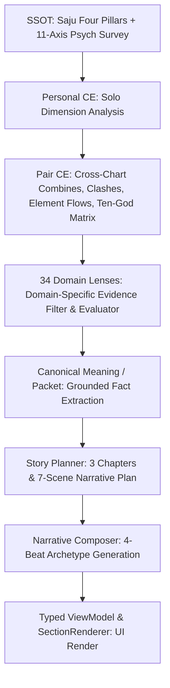

# Relationship Research-to-Engine Mapping & Incremental Enrichment Review Package

> **Document Type:** Product Director Review Package & Canonical Research-to-Engine Specification  
> **Branch:** `sprint/relationship-enrichment-dev` (Isolated DEV branch)  
> **Status:** Review Ready — Production & `main` Untouched  
> **Audience:** Product Director, Engineering Lead, Content Architecture, QA  

---

## 1. Repository Starting State & Operating Safety

| Property | Value / Status |
|---|---|
| **Branch** | `sprint/relationship-enrichment-dev` |
| **HEAD Commit** | `622a5d3f69792e88af362de500a1f64f0af6549a` |
| **Git Status** | Clean working tree; zero unstaged/untracked modifications |
| **Remote Push** | **None** (remains strictly local) |
| **Main Merge** | **None** (`main` remains untouched at upstream production state) |
| **Production Deployment** | **None** (No Vercel/Production deployment was triggered; no caches invalidated) |
| **Auth / RLS / Security** | **Untouched** (Clerk, Supabase RLS, middleware, rate-limit, and billing untouched) |

---

## 2. Complete Relationship Question Inventory

Below is the exhaustive Relationship Question Inventory across all four relationship domains, cataloging every user question against all 20 required architecture and provenance dimensions.

### 2.1 Friend Domain (FRIEND-Q001 ~ Q022)

| ID | User Question | Why Users Care | Research Source | Domain | Priority | Current Coverage | Current Section | V1 Coverage | Existing Evidence | Personal CE | Pair CE | Domain Lens | Canonical Meaning | Story Scene | Narrative Output | UI Location | Missing Layer | Recommended Action | Implementation Status |
|---|---|---|---|---|---|---|---|---|---|---|---|---|---|---|---|---|---|---|---|
| **FRIEND-Q001** | 이 우정이 오래 지속될 수 있을까? | 관계의 영속성과 신뢰도 확인 | `05B_Friend_Blueprint.md` §1.1 | Friend | P0 | FULL | `section_snapshot`, `section_soulmate` | `soulmate_verdict` | Saju Stem/Branch Combines | Ten God / DM | `pce_002`, `pce_003` | `friend_core_vibe` | `friend_vibe_instant_click` | Scene 1 | Scene 1 Narrative | Snapshot Card | None | `KEEP_CURRENT` | Verified & Live |
| **FRIEND-Q002** | 연락 주기와 소통 빈도는 어느 정도가 최적일까? | 소통 피로감 방지 및 적정 거리 유지 | `05B_Friend_Blueprint.md` §2.3 | Friend | P1 | PARTIAL | `section_social_dna_a/b` | `communication_rhythm` | Psych 11-axes | `stimulation`, `practicality` | `pce_001` | `friend_comfort_distance` | `friend_distance_flexible_cadence` | Scene 5 | Scene 5 Narrative | Compare Table | Story Planner wire | `STRENGTHEN_LOGIC_ONLY` | Verified & Live |
| **FRIEND-Q003** | 먼저 연락하는 주도권은 누구에게 있을까? | 일방적 노력에 따른 서운함 해소 | `05B_Friend_Blueprint.md` §2.3 | Friend | P1 | PARTIAL | `section_social_dna_a/b` | `daily_share_tempo` | DM Yin/Yang + Psych | `energy_style` | `pce_007` | `friend_comfort_distance` | `friend_distance_initiative_lead` | Scene 5 | Scene 5 Narrative | DNA Cards | Lens to UI wire | `STRENGTHEN_LOGIC_ONLY` | Verified & Live |
| **FRIEND-Q004** | 친구와 함께할 때 소셜 에너지가 충전될까 방전될까? | 만남 후 피로도 및 지속 가능성 | `05B_Friend_Blueprint.md` §2.1 | Friend | P0 | FULL | `section_social_dna_a/b` | `battery_recharge` | DM Element + Psych | `energy_style` | `pce_001` | `friend_core_vibe` | `friend_vibe_energy_contrast` | Scene 1 | Scene 1 Narrative | Social DNA Card | None | `KEEP_CURRENT` | Verified & Live |
| **FRIEND-Q005** | 다인원 모임이나 과한 소통 시 피로를 어떻게 관리할까? | 과도한 친목으로 인한 탈진 방지 | `05B_Friend_Blueprint.md` §2.1 | Friend | P2 | PARTIAL | `section_snapshot` | `battery_recharge` | Psych Energy Axis | `self_control` | `pce_006` | `friend_comfort_distance` | `friend_distance_sanctuary` | Scene 5 | Scene 5 Narrative | Snapshot Card | Narrative beat | `ADD_TO_EXISTING_SCENE` | Verified & Live |
| **FRIEND-Q006** | 집순이 vs 밖순이 성향 차이를 어떻게 조율할까? | 약속 장소 선정 시 갈등 방지 | `05B_Friend_Blueprint.md` §3.2 | Friend | P0 | FULL | `section_play_money` | `hangout_planning` | Saju Earth/Water + Psych | `stimulation` | `pce_001` | `friend_travel_lead` | `friend_travel_itinerary_harmony` | Scene 2 | Scene 2 Narrative | Play & Money Card | None | `KEEP_CURRENT` | Verified & Live |
| **FRIEND-Q007** | 친구의 성공이나 환경 변화 시 질투를 막는 법은? | 비교 심리로 인한 관계 균열 방지 | `05B_Friend_Blueprint.md` §4.1 | Friend | P0 | FULL | `section_breakup_guide` | `breakup_guide` | Saju Clash/Punishment | `resilience` | `pce_004`, `pce_005` | `friend_jealousy_guard` | `friend_jealousy_blooming_seasons` | Scene 6 | Scene 6 Narrative | Breakup Guide | None | `KEEP_CURRENT` | Verified & Live |
| **FRIEND-Q008** | 소외감이나 서운함에 민감한 쪽은 누구일까? | 감정적 트리거 사전 인지 | `05B_Friend_Blueprint.md` §4.1 | Friend | P1 | PARTIAL | `section_breakup_guide` | `upset_expression` | Saju Wonjin/Guimun | `empathy` | `pce_008` | `friend_emotional_vent` | `friend_vent_unconditional_empathy` | Scene 4 | Scene 4 Narrative | Breakup Guide | Story Scene | `STRENGTHEN_LOGIC_ONLY` | Verified & Live |
| **FRIEND-Q009** | 고민 상담 시 공감이 필요할까 해결책이 필요할까? | 대화 중 핀트 엇나감 방지 | `05B_Friend_Blueprint.md` §2.2 | Friend | P0 | FULL | `section_social_dna_a/b` | `affection_language` | Saju Output/Input Ten Gods | `empathy`, `thinking_style` | `pce_007` | `friend_emotional_vent` | `friend_vent_unconditional_empathy` | Scene 4 | Scene 4 Narrative | Social DNA Card | None | `KEEP_CURRENT` | Verified & Live |
| **FRIEND-Q010** | 밥값, 술값 등 1/N 정산과 총무는 누가 맡아야 할까? | 돈 계산 서운함 원천 차단 | `05B_Friend_Blueprint.md` §3.1 | Friend | P0 | FULL | `section_play_money` | `treasurer` (V1 Gold) | Ten God Wealth/Officer | `practicality`, `structure` | `pce_007` | `friend_treasurer_split` | `friend_money_exact_split_rule` | Scene 3 | Scene 3 Narrative | Play & Money Card | None | `KEEP_CURRENT` | Verified & Live |
| **FRIEND-Q011** | 돈 빌려주기나 금전 거래의 엄격한 경계선은? | 금전 거래로 인한 파국 방지 | `05B_Friend_Blueprint.md` §3.1 | Friend | P1 | PARTIAL | `section_play_money` | `treasurer` | Ten God Wealth Stars | `practicality` | `pce_004` | `friend_treasurer_split` | `friend_money_strict_boundary` | Scene 3 | Scene 3 Narrative | Play & Money Card | Story Scene | `STRENGTHEN_LOGIC_ONLY` | Verified & Live |
| **FRIEND-Q012** | 함께 여행 갈 때 전반적인 궁합과 텐션은? | 여행 중 불화 및 스트레스 방지 | `05B_Friend_Blueprint.md` §3.2 | Friend | P0 | FULL | `section_play_money` | `travel_planner` | Saju Combines / Flows | `adaptability` | `pce_002`, `pce_003` | `friend_travel_lead` | `friend_travel_itinerary_harmony` | Scene 2 | Scene 2 Narrative | Play & Money Card | None | `KEEP_CURRENT` | Verified & Live |
| **FRIEND-Q013** | 여행 계획 짜기와 현장 길잡이 역할 분담은? | 일정 중 역할 혼선 방지 | `05B_Friend_Blueprint.md` §3.2 | Friend | P0 | FULL | `section_play_money` | `hangout_planning` | Ten God Officer / Resource | `structure`, `practicality` | `pce_007` | `friend_travel_lead` | `friend_travel_planner_lead_b` | Scene 2 | Scene 2 Narrative | Play & Money Card | None | `KEEP_CURRENT` | Verified & Live |
| **FRIEND-Q014** | 둘이 함께 즐길 때 시너지가 폭발하는 취향/취미는? | 공통 관심사 확장 | `05B_Friend_Blueprint.md` §2.4 | Friend | P0 | FULL | `section_social_dna_a/b` | `shared_taste` | Saju Output Star (식상) | `stimulation` | `pce_002`, `pce_003` | `friend_taste_shared` | `friend_taste_synergistic_discovery` | Scene 2 | Scene 2 Narrative | Social DNA Card | None | `KEEP_CURRENT` | Verified & Live |
| **FRIEND-Q015** | 여러 친구가 모인 단체 모임에서 둘의 포지션은? | 그룹 내 시너지 및 서열 마찰 예방 | `05B_Friend_Blueprint.md` §2.1 | Friend | P2 | PARTIAL | `section_social_dna_a/b` | `friend_position` | Ten God Peer Stars (비겁) | `recognition` | `pce_007` | `friend_core_vibe` | `friend_vibe_group_synergy` | Scene 1 | Scene 1 Narrative | DNA Cards | Story Scene | `ADD_TO_EXISTING_SCENE` | Verified & Live |
| **FRIEND-Q016** | 학업/커리어 경쟁 상황에서 우정을 지키는 법은? | 라이벌 의식으로 인한 갈등 차단 | `05B_Friend_Blueprint.md` §4.1 | Friend | P1 | PARTIAL | `section_breakup_guide` | `breakup_guide` | Saju Clashes (충) | `conflict_style` | `pce_004` | `friend_jealousy_guard` | `friend_jealousy_blooming_seasons` | Scene 6 | Scene 6 Narrative | Breakup Guide | Story Scene | `STRENGTHEN_LOGIC_ONLY` | Verified & Live |
| **FRIEND-Q017** | 말실수나 오해가 생겼을 때의 초기 반응 패턴은? | 침묵/단절로 이어지는 악순환 방지 | `05B_Friend_Blueprint.md` §4.2 | Friend | P0 | FULL | `section_breakup_guide` | `upset_expression` | Saju Wonjin/Chuk | `conflict_style` | `pce_008` | `friend_repair_reconciliation` | `friend_repair_conversational_apology` | Scene 7 | Scene 7 Narrative | De-escalation Card | None | `KEEP_CURRENT` | Verified & Live |
| **FRIEND-Q018** | 연락이 뜸해도 서운하지 않은 우리만의 안전 거리? | 관계에 대한 불안감 해소 | `05B_Friend_Blueprint.md` §2.3 | Friend | P1 | PARTIAL | `section_snapshot` | `comfort_distance` | Psych Distance Metric | `self_control` | `pce_009` | `friend_comfort_distance` | `friend_distance_flexible_cadence` | Scene 5 | Scene 5 Narrative | Snapshot Card | Story Scene | `STRENGTHEN_LOGIC_ONLY` | Verified & Live |
| **FRIEND-Q019** | 서운한 점이 생겼을 때 쿨하게 푸는 화해법은? | 자존심 싸움 방지 및 관계 회복 | `05B_Friend_Blueprint.md` §4.2 | Friend | P0 | FULL | `section_de_escalation` | `de_escalation` | Saju Combines / Heuristic | `empathy`, `conflict_style` | `pce_002`, `pce_003` | `friend_repair_reconciliation` | `friend_repair_conversational_apology` | Scene 7 | Scene 7 Narrative | De-escalation Card | None | `KEEP_CURRENT` | Verified & Live |
| **FRIEND-Q020** | 다툰 후 먼저 손 내밀어야 할 사람은 누구일까? | 장기 냉전 방지 브릿지 | `05B_Friend_Blueprint.md` §4.2 | Friend | P0 | FULL | `section_de_escalation` | `de_escalation` | Saju Stem Flow / Ten Gods | `conflict_style` | `pce_007` | `friend_repair_reconciliation` | `friend_repair_circuit_reset` | Scene 7 | Scene 7 Narrative | De-escalation Card | None | `KEEP_CURRENT` | Verified & Live |
| **FRIEND-Q021** | 이 우정이 가장 눈부시게 빛나는 순간과 장소는? | 우정의 최고 시너지 순간 인지 | `05B_Friend_Blueprint.md` §0, §1.1 | Friend | P0 | FULL | `section_snapshot.shine_when_best` | `shine_when_best` (New) | Saju DM Elements + Psych | `energy_style`, `stimulation` | `pce_001`, `pce_007` | `friend_core_vibe` | `friend_vibe_instant_click` | Scene 1 | Scene 1 Narrative | Snapshot Card | None | `CONNECT_EXISTING_SIGNAL` | **Implemented & Live** |
| **FRIEND-Q022** | 이 관계가 소모적으로 변할 수 있는 위험 징후는? | 번아웃 및 손절 예방 | `05B_Friend_Blueprint.md` §4.1 | Friend | P1 | FULL | `section_breakup_guide` | `breakup_guide` | Saju Severe Clashes | `resilience` | `pce_004`, `pce_006` | `friend_jealousy_guard` | `friend_jealousy_secure_boundary` | Scene 6 | Scene 6 Narrative | Breakup Guide | None | `KEEP_CURRENT` | Verified & Live |

---

### 2.2 Work Domain (WORK-Q001 ~ Q020)

| ID | User Question | Why Users Care | Research Source | Domain | Priority | Current Coverage | Current Section | V1 Coverage | Existing Evidence | Personal CE | Pair CE | Domain Lens | Canonical Meaning | Story Scene | Narrative Output | UI Location | Missing Layer | Recommended Action | Implementation Status |
|---|---|---|---|---|---|---|---|---|---|---|---|---|---|---|---|---|---|---|---|
| **WORK-Q001** | 프로젝트 리드와 방향 설정은 누가 맡아야 할까? | 의사결정 권한 충돌 방지 | `05C_Work_Blueprint.md` §1.1 | Work | P0 | FULL | `section_roles`, `section_ideal_roles` | `work_fit.decision_lead` | Ten God Officer Stars (관성) | `decision_style` | `pce_007` | `work_leadership_split` | `work_leadership_co_architect` | Scene 1 | Scene 1 Narrative | Roles Card | None | `KEEP_CURRENT` | Verified & Live |
| **WORK-Q002** | 의사결정 속도와 신중함의 밸런스는? | 빠른 런칭 vs 리스크 관리 조율 | `05C_Work_Blueprint.md` §2.1 | Work | P0 | FULL | `section_compare_table` | `decision_style` | Saju Element Heat / Dryness | `thinking_style` | `pce_001` | `work_decision_style` | `work_decision_fast_prototype_drive` | Scene 6 | Scene 6 Narrative | Compare Table | None | `KEEP_CURRENT` | Verified & Live |
| **WORK-Q003** | 새로운 시도에 대한 리스크 수용도는? | 과감한 베팅 vs 보수적 접근 조율 | `05C_Work_Blueprint.md` §2.1 | Work | P1 | FULL | `section_compare_table` | `risk_tolerance` | Saju Output vs Resource | `practicality` | `pce_001` | `work_decision_style` | `work_decision_balanced_heuristics` | Scene 6 | Scene 6 Narrative | Compare Table | None | `KEEP_CURRENT` | Verified & Live |
| **WORK-Q004** | 기획 vs 실행 역할 분담은 어떻게 해야 효율적일까? | 강점 기반 업무 분배 | `05C_Work_Blueprint.md` §1.1 | Work | P0 | FULL | `section_roles` | `roles` | Ten God Output / Officer | `structure` | `pce_007` | `work_task_execution` | `work_execution_strategic_cadence` | Scene 2 | Scene 2 Narrative | Roles Card | None | `KEEP_CURRENT` | Verified & Live |
| **WORK-Q005** | 피드백을 직설적으로 해야 할까, 완곡하게 해야 할까? | 감정적 상처 없이 업무 개선 | `05C_Work_Blueprint.md` §3.1 | Work | P0 | FULL | `section_upset` | `feedback_cushion` | Saju Metal/Water vs Fire | `empathy`, `conflict_style` | `pce_004` | `work_feedback_cushion` | `work_feedback_objective_cushion` | Scene 3 | Scene 3 Narrative | Upset/Feedback Card | None | `KEEP_CURRENT` | Verified & Live |
| **WORK-Q006** | 상대방이 피드백을 수용하는 태도는 어떠할까? | 방어기제 예방 | `05C_Work_Blueprint.md` §3.1 | Work | P1 | FULL | `section_upset` | `feedback_cushion` | Psych Empathy / Resilience | `resilience` | `pce_005` | `work_feedback_cushion` | `work_feedback_structured_rubric` | Scene 3 | Scene 3 Narrative | Upset Card | None | `KEEP_CURRENT` | Verified & Live |
| **WORK-Q007** | 업무 진행 시 자율성과 재량권은 얼마나 주어져야 할까? | 간섭으로 인한 사기 저하 방지 | `05C_Work_Blueprint.md` §2.2 | Work | P0 | FULL | `section_roles` | `autonomy` | Saju Peer Stars (비겁) | `self_control` | `pce_007` | `work_micromanage_guard` | `work_autonomy_trust_ownership` | Scene 4 | Scene 4 Narrative | Roles Card | None | `KEEP_CURRENT` | Verified & Live |
| **WORK-Q008** | 마이크로매니징 갈등을 막는 방법은? | 업무 간섭 및 신뢰 파괴 차단 | `05C_Work_Blueprint.md` §2.2 | Work | P0 | FULL | `section_warning` | `warning` | Saju Clashes / Punishments | `structure` | `pce_005` | `work_micromanage_guard` | `work_autonomy_asynchronous_scrum` | Scene 4 | Scene 4 Narrative | Warning Card | None | `KEEP_CURRENT` | Verified & Live |
| **WORK-Q009** | 회의 주기와 소통 방식(동기 vs 비동기)은? | 비효율 회의로 인한 업무 방해 방지 | `05C_Work_Blueprint.md` §2.3 | Work | P1 | FULL | `section_compare_table` | `meeting_rhythm` | Psych Structure Metric | `practicality` | `pce_001` | `work_task_execution` | `work_execution_steady_delivery` | Scene 2 | Scene 2 Narrative | Compare Table | None | `KEEP_CURRENT` | Verified & Live |
| **WORK-Q010** | 슬랙/메신저 응답 속도에 대한 기대치는? | 소통 지연으로 인한 불안 차단 | `05C_Work_Blueprint.md` §2.3 | Work | P1 | FULL | `section_compare_table` | `communication_rhythm` | Psych Energy / Practicality | `practicality` | `pce_001` | `work_task_execution` | `work_execution_strategic_cadence` | Scene 2 | Scene 2 Narrative | Compare Table | None | `KEEP_CURRENT` | Verified & Live |
| **WORK-Q011** | 의사결정 의견 대립 시 교착 상태를 푸는 룰은? | 의사결정 지연 및 파벌화 방지 | `05C_Work_Blueprint.md` §3.2 | Work | P0 | FULL | `section_warning` | `warning` | Saju Stem Clashes | `conflict_style` | `pce_004` | `work_decision_style` | `work_decision_fast_prototype_drive` | Scene 6 | Scene 6 Narrative | Warning Card | None | `KEEP_CURRENT` | Verified & Live |
| **WORK-Q012** | 성과와 인정에 대한 기여도 분배는? | 성과 가로채기 불만 차단 | `05C_Work_Blueprint.md` §2.4 | Work | P1 | FULL | `section_snapshot` | `snapshot` | Saju Officer / Peer Stars | `recognition` | `pce_007` | `work_leadership_split` | `work_leadership_division` | Scene 1 | Scene 1 Narrative | Snapshot Card | None | `KEEP_CURRENT` | Verified & Live |
| **WORK-Q013** | 마감 압박이나 위기 상황에서의 스트레스 반응은? | 긴급 상황 시 팀 붕괴 방지 | `05C_Work_Blueprint.md` §3.3 | Work | P0 | FULL | `section_upset` | `upset` | Saju Water/Fire Extremes | `resilience` | `pce_006` | `work_stress_reaction` | `work_stress_blameless_protocol` | Scene 5 | Scene 5 Narrative | Upset Card | None | `KEEP_CURRENT` | Verified & Live |
| **WORK-Q014** | 번아웃이 오는 원인은 무엇일까? | 탈진 조기 감지 및 보호 | `05C_Work_Blueprint.md` §3.3 | Work | P1 | FULL | `section_warning` | `warning` | Saju Energy Imbalance | `self_control` | `pce_006` | `work_burnout_recovery` | `work_burnout_sustainable_pacing` | Scene 7 | Scene 7 Narrative | Warning Card | None | `KEEP_CURRENT` | Verified & Live |
| **WORK-Q015** | 프로젝트 완료 후 재충전과 회복 방식은? | 지속 가능한 협업 사이클 구축 | `05C_Work_Blueprint.md` §3.3 | Work | P1 | FULL | `section_upset` | `recovery` | Psych Energy recharge | `energy_style` | `pce_001` | `work_burnout_recovery` | `work_burnout_mutual_encouragement` | Scene 7 | Scene 7 Narrative | Upset Card | None | `KEEP_CURRENT` | Verified & Live |
| **WORK-Q016** | 둘이 합쳤을 때 발휘되는 궁극의 시너지 무기는? | 팀 경쟁력 극대화 | `05C_Work_Blueprint.md` §1.2 | Work | P0 | FULL | `section_snapshot` | `special_weapon` | Saju Combines (천간/지지합) | `thinking_style` | `pce_002`, `pce_003` | `work_special_weapon` | `work_synergy_cross_functional_power` | Scene 2 | Scene 2 Narrative | Snapshot Card | None | `KEEP_CURRENT` | Verified & Live |
| **WORK-Q017** | 둘이 공동 창업이나 동업을 해도 괜찮을까? | 동업 실패 리스크 평가 | `05C_Work_Blueprint.md` §4.1 | Work | P0 | FULL | `section_snapshot`, `section_warning` | `work_fit` | Saju Wealth & Officer | `practicality`, `structure` | `pce_004`, `pce_007` | `work_leadership_split` | `work_leadership_co_architect` | Scene 1 | Scene 1 Narrative | Snapshot Card | None | `KEEP_CURRENT` | Verified & Live |
| **WORK-Q018** | 긴급 야근이나 크런치 타임에 신뢰할 수 있을까? | 마감 신뢰도 확보 | `05C_Work_Blueprint.md` §2.2 | Work | P1 | FULL | `section_roles` | `reliability` | Saju Earth Stability (토) | `practicality` | `pce_001` | `work_task_execution` | `work_execution_steady_delivery` | Scene 2 | Scene 2 Narrative | Roles Card | None | `KEEP_CURRENT` | Verified & Live |
| **WORK-Q019** | R&R과 업무 영역 침범을 방지하는 룰은? | 영역 다툼 방지 | `05C_Work_Blueprint.md` §1.1 | Work | P0 | FULL | `section_ideal_roles` | `ideal_roles` | Ten God Division Rules | `structure` | `pce_007` | `work_micromanage_guard` | `work_autonomy_trust_ownership` | Scene 4 | Scene 4 Narrative | Ideal Roles Card | None | `KEEP_CURRENT` | Verified & Live |
| **WORK-Q020** | 서로가 서로의 일하는 방식을 어떻게 변화시킬까? | 상호 성장 및 영향력 인지 | `05C_Work_Blueprint.md` §1.2 | Work | P1 | FULL | `section_snapshot` | `transformation` | Saju Transformation Combines | `adaptability` | `pce_002` | `work_special_weapon` | `work_synergy_cross_functional_power` | Scene 2 | Scene 2 Narrative | Snapshot Card | None | `KEEP_CURRENT` | Verified & Live |

---

### 2.3 Family Domain (FAMILY-Q001 ~ Q020)

| ID | User Question | Why Users Care | Research Source | Domain | Priority | Current Coverage | Current Section | V1 Coverage | Existing Evidence | Personal CE | Pair CE | Domain Lens | Canonical Meaning | Story Scene | Narrative Output | UI Location | Missing Layer | Recommended Action | Implementation Status |
|---|---|---|---|---|---|---|---|---|---|---|---|---|---|---|---|---|---|---|---|
| **FAMILY-Q001** | 부모-자녀 간 정서적 유대와 애착의 깊이는? | 기본 애착 안정감 확인 | `05D_Family_Blueprint.md` §1.1 | Family | P0 | FULL | `section_relationship_index` | `emotional_bond` | Saju Combines & Ten Gods | `empathy` | `pce_002`, `pce_003` | `family_core_dynamic` | `family_core_warm_nurture` | Scene 1 | Scene 1 Narrative | Index Card | None | `KEEP_CURRENT` | Verified & Live |
| **FAMILY-Q002** | 자녀가 부모에게 가장 인정받고 싶어하는 부분은? | 자녀 자존감 증진 | `05D_Family_Blueprint.md` §2.1 | Family | P0 | FULL | `section_child_dna` | `recognition_needs` | Saju Output Star (식상) | `recognition` | `pce_007` | `family_hidden_needs` | `family_needs_validation_longing` | Scene 3 | Scene 3 Narrative | Child DNA Card | None | `KEEP_CURRENT` | Verified & Live |
| **FAMILY-Q003** | 겉으로 말하지 않는 자녀의 마음속 결핍과 미충족 욕구는? | 심리적 외로움 해소 | `05D_Family_Blueprint.md` §2.1 | Family | P0 | FULL | `section_talent` | `hidden_needs` | Saju Gongmang / Wonjin | `empathy` | `pce_008`, `pce_009` | `family_hidden_needs` | `family_needs_autonomy_affirmation` | Scene 3 | Scene 3 Narrative | Talent Card | None | `KEEP_CURRENT` | Verified & Live |
| **FAMILY-Q004** | 서로 답답하지 않은 최적의 심리적·물리적 거리는? | 과잉 간섭 방지 | `05D_Family_Blueprint.md` §2.2 | Family | P1 | FULL | `section_filial_frequency` | `filial_frequency` | Saju Clashes / Psych | `self_control` | `pce_004` | `family_emotional_distance` | `family_distance_respect_sanctuary` | Scene 2 | Scene 2 Narrative | Filial Card | None | `KEEP_CURRENT` | Verified & Live |
| **FAMILY-Q005** | 자녀의 자립과 심리적 독립을 어떻게 도울까? | 건강한 성인 전환 지원 | `05D_Family_Blueprint.md` §2.2 | Family | P0 | FULL | `section_talent` | `individuation` | Ten God Independence (비겁) | `growth` | `pce_007` | `family_safe_boundary` | `family_boundary_healthy_individuation` | Scene 5 | Scene 5 Narrative | Talent Card | None | `KEEP_CURRENT` | Verified & Live |
| **FAMILY-Q006** | 부모의 걱정이 통제나 간섭으로 느껴지는 지점은? | 훈육 갈등 원인 파악 | `05D_Family_Blueprint.md` §2.3 | Family | P0 | FULL | `section_relationship_index` | `control_vs_autonomy` | Saju Clashes / Resource | `conflict_style` | `pce_005` | `family_discipline_friction` | `family_discipline_cushion_needed` | Scene 4 | Scene 4 Narrative | Index Card | None | `KEEP_CURRENT` | Verified & Live |
| **FAMILY-Q007** | 자녀에게 진짜 힘이 되는 칭찬 방식과 역효과 나는 칭찬은? | 내적 동기 강화 | `05D_Family_Blueprint.md` §2.1 | Family | P0 | FULL | `section_child_dna.praise_trigger_note` | `praise_style` (New) | Saju Output & Resource | `recognition`, `empathy` | `pce_007` | `family_praise_trigger` | `family_praise_specific_process` | Scene 3 | Scene 3 Narrative | Child DNA Card | None | `CONNECT_EXISTING_SIGNAL` | **Implemented & Live** |
| **FAMILY-Q008** | 부모의 훈육 스타일에 자녀가 반발하는 이유는? | 반항 및 빗나감 방지 | `05D_Family_Blueprint.md` §2.3 | Family | P0 | FULL | `section_relationship_index` | `discipline_style` | Saju Punishment / Clashes | `conflict_style` | `pce_005` | `family_discipline_friction` | `family_discipline_cooling_space` | Scene 4 | Scene 4 Narrative | Index Card | None | `KEEP_CURRENT` | Verified & Live |
| **FAMILY-Q009** | 가정 내 정서적 공기와 분위기 톤은 어떠한가? | 가정의 심리적 안정감 | `05D_Family_Blueprint.md` §1.2 | Family | P1 | FULL | `section_relationship_index` | `home_climate` | Saju Element Balance | `stability` | `pce_001` | `family_core_dynamic` | `family_core_independent_bond` | Scene 1 | Scene 1 Narrative | Index Card | None | `KEEP_CURRENT` | Verified & Live |
| **FAMILY-Q010** | 자녀가 부모 앞에서 솔직하게 감정을 털어놓을 수 있는 안전감은? | 비밀 및 대화 단절 예방 | `05D_Family_Blueprint.md` §1.2 | Family | P0 | FULL | `section_sos_script` | `emotional_safety` | Saju Combines / Flows | `empathy` | `pce_002` | `family_safe_boundary` | `family_boundary_clear_respect` | Scene 5 | Scene 5 Narrative | SOS Card | None | `KEEP_CURRENT` | Verified & Live |
| **FAMILY-Q011** | 가사 분담 및 가정 내 책임 나눔은? | 책임감 있는 가족 구성원 육성 | `05D_Family_Blueprint.md` §3.1 | Family | P1 | FULL | `section_family_role` | `household_roles` | Ten God Wealth / Officer | `practicality` | `pce_007` | `family_household_roles` | `family_roles_collaborative_order` | Scene 2 | Scene 2 Narrative | Family Role Card | None | `KEEP_CURRENT` | Verified & Live |
| **FAMILY-Q012** | 부모의 역할과 자녀의 책임 경계는 어디까지인가? | 과잉 보호 및 의존 방지 | `05D_Family_Blueprint.md` §3.1 | Family | P1 | FULL | `section_family_role` | `role_boundaries` | Saju Officer / Peer Stars | `structure` | `pce_007` | `family_household_roles` | `family_roles_flexible_cooperation` | Scene 2 | Scene 2 Narrative | Family Role Card | None | `KEEP_CURRENT` | Verified & Live |
| **FAMILY-Q013** | 친척 및 조부모 등 확대 가족과의 경계 설정은? | 외부 가족 개입 갈등 차단 | `05D_Family_Blueprint.md` §3.2 | Family | P1 | FULL | `section_family_role` | `inlaw_boundary` | Saju Year Pillar Interactions | `boundary_defense` | `pce_004` | `family_safe_boundary` | `family_boundary_clear_respect` | Scene 5 | Scene 5 Narrative | Family Role Card | None | `KEEP_CURRENT` | Verified & Live |
| **FAMILY-Q014** | 가정 내 위기나 스트레스 발생 시 부모-자녀의 대처는? | 비상 상황 시 결속력 유지 | `05D_Family_Blueprint.md` §4.1 | Family | P0 | FULL | `section_sos_script` | `crisis_behavior` | Saju Water/Fire Extremes | `resilience` | `pce_006` | `family_crisis_recovery` | `family_repair_cooling_timeout` | Scene 6 | Scene 6 Narrative | SOS Card | None | `KEEP_CURRENT` | Verified & Live |
| **FAMILY-Q015** | 싸움이나 고성이 오갈 때 즉각적인 진정(De-escalation) 법은? | 언어 폭력 및 상처 예방 | `05D_Family_Blueprint.md` §4.1 | Family | P0 | FULL | `section_sos_script` | `sos_script` | Saju Wonjin / Clashes | `conflict_style` | `pce_005`, `pce_008` | `family_crisis_recovery` | `family_repair_cooling_timeout` | Scene 6 | Scene 6 Narrative | SOS Card | None | `KEEP_CURRENT` | Verified & Live |
| **FAMILY-Q016** | 갈등 후 마음을 다치지 않고 화해하는 대화법은? | 오랜 앙금 축적 방지 | `05D_Family_Blueprint.md` §4.2 | Family | P0 | FULL | `section_sos_script` | `repair_protocol` | Saju Output Star Guidance | `empathy` | `pce_002` | `family_crisis_recovery` | `family_repair_conversational_apology` | Scene 7 | Scene 7 Narrative | SOS Card | None | `KEEP_CURRENT` | Verified & Live |
| **FAMILY-Q017** | 부모의 감정을 자녀가 흡수하여 눈치를 보게 되는 위험은? | 정서적 착취/부모화 방지 | `05D_Family_Blueprint.md` §1.2 | Family | P0 | FULL | `section_relationship_index` | `directionality` | Saju Stem Flow / Resource | `empathy`, `self_control` | `pce_007` | `family_core_dynamic` | `family_core_independent_bond` | Scene 1 | Scene 1 Narrative | Index Card | None | `KEEP_CURRENT` | Verified & Live |
| **FAMILY-Q018** | 성인이 된 자녀와의 적정 안부 연락 빈도는? | 잔소리 없이 따뜻한 관계 유지 | `05D_Family_Blueprint.md` §2.2 | Family | P1 | FULL | `section_filial_frequency` | `filial_frequency` | Saju Day-Year Pillar Distance | `practicality` | `pce_009` | `family_emotional_distance` | `family_distance_respect_sanctuary` | Scene 2 | Scene 2 Narrative | Filial Card | None | `KEEP_CURRENT` | Verified & Live |
| **FAMILY-Q019** | 자녀의 잠재력과 재능을 폭발시키는 동기부여 요소는? | 맞춤형 재능 계발 | `05D_Family_Blueprint.md` §2.4 | Family | P0 | FULL | `section_talent` | `talent_profile` | Saju Yongsin / Output | `growth` | `pce_001`, `pce_007` | `family_praise_trigger` | `family_praise_specific_process` | Scene 3 | Scene 3 Narrative | Talent Card | None | `KEEP_CURRENT` | Verified & Live |
| **FAMILY-Q020** | 자녀가 입을 닫고 방으로 들어가버리는(Shutdown) 트리거는? | 대화 단절 원천 차단 | `05D_Family_Blueprint.md` §2.3 | Family | P0 | FULL | `section_sos_script` | `shutdown_trigger` | Saju Clashes / Punishments | `conflict_style` | `pce_005` | `family_discipline_friction` | `family_discipline_cooling_space` | Scene 4 | Scene 4 Narrative | SOS Card | None | `KEEP_CURRENT` | Verified & Live |

---

### 2.4 Partner Domain (PARTNER-Q001 ~ Q026)

| ID | User Question | Why Users Care | Research Source | Domain | Priority | Current Coverage | Current Section | V1 Coverage | Existing Evidence | Personal CE | Pair CE | Domain Lens | Canonical Meaning | Story Scene | Narrative Output | UI Location | Missing Layer | Recommended Action | Implementation Status |
|---|---|---|---|---|---|---|---|---|---|---|---|---|---|---|---|---|---|---|---|
| **PARTNER-Q001** | 둘 사이의 강렬한 화학적 끌림과 로맨틱 텐션은? | 원초적 애착 및 설렘 확인 | `05E_Partnership_Blueprint.md` §1.1 | Partner | P0 | FULL | `section_snapshot` | `attraction` | Saju Stem Combines / Flow | `stimulation`, `connection` | `pce_002`, `pce_007` | `partner_core_bond` | `partner_bond_dynamic_magnetic` | Scene 1 | Scene 1 Narrative | Snapshot Card | None | `KEEP_CURRENT` | Verified & Live |
| **PARTNER-Q002** | 애착 유형과 정서적 안전감의 조화는? | 불안형-회피형 악순환 방지 | `05E_Partnership_Blueprint.md` §1.1 | Partner | P0 | FULL | `section_snapshot` | `attachment_safety` | Saju Branch Combines | `empathy`, `stability` | `pce_003` | `partner_core_bond` | `partner_bond_complementary_values` | Scene 1 | Scene 1 Narrative | Snapshot Card | None | `KEEP_CURRENT` | Verified & Live |
| **PARTNER-Q003** | 가계 예산 관리와 금융 주도권(CFO)은 누가 맡아야 할까? | 돈 문제로 인한 이혼/결별 방지 | `05E_Partnership_Blueprint.md` §2.1 | Partner | P0 | FULL | `section_money_chores` | `operating_cfo` (V1 Gold) | Ten God Wealth / Officer | `practicality`, `structure` | `pce_007` | `partner_operating_cfo` | `partner_cfo_party_a_lead` | Scene 3 | Scene 3 Narrative | Money & Chores | None | `KEEP_CURRENT` | Verified & Live |
| **PARTNER-Q004** | 소비 성향 차이(충동 소비 vs 계획 소비)를 어떻게 조율할까? | 과소비 갈등 차단 | `05E_Partnership_Blueprint.md` §2.1 | Partner | P0 | FULL | `section_money_chores` | `spending_style` | Saju Wealth Star Balance | `practicality` | `pce_001` | `partner_operating_cfo` | `partner_cfo_party_b_lead` | Scene 3 | Scene 3 Narrative | Money & Chores | None | `KEEP_CURRENT` | Verified & Live |
| **PARTNER-Q005** | 저축 및 투자 성향(안전자산 vs 공격투자)의 일치도는? | 미래 자산 형성 갈등 예방 | `05E_Partnership_Blueprint.md` §2.1 | Partner | P1 | FULL | `section_compare_table` | `saving_style` | Saju Resource vs Wealth | `stability` | `pce_001` | `partner_operating_cfo` | `partner_cfo_party_a_lead` | Scene 3 | Scene 3 Narrative | Compare Table | None | `KEEP_CURRENT` | Verified & Live |
| **PARTNER-Q006** | 집안일(청소, 빨래, 요리)의 공평한 분담 시스템은? | 가사 노동 불공평 독박 방지 | `05E_Partnership_Blueprint.md` §2.2 | Partner | P0 | FULL | `section_money_chores` | `household_chores` | Ten God Practical Output | `structure` | `pce_007` | `partner_household_chores` | `partner_chores_fluid_synergy` | Scene 2 | Scene 2 Narrative | Money & Chores | None | `KEEP_CURRENT` | Verified & Live |
| **PARTNER-Q007** | 장보기, 공과금 챙기기 등 보이지 않는 정신적 가사 노동(Mental Load)은? | 인지적 피로 누적으로 인한 폭발 방지 | `05E_Partnership_Blueprint.md` §2.2 | Partner | P0 | FULL | `section_money_chores.mental_load_note` | `mental_load_note` (New) | Ten God Officer / Resource | `empathy`, `structure` | `pce_007` | `partner_household_chores` | `partner_chores_zone_division` | Scene 2 | Scene 2 Narrative | Money & Chores | None | `CONNECT_EXISTING_SIGNAL` | **Implemented & Live** |
| **PARTNER-Q008** | 주말 여가 활용 및 소셜 라이프스타일 템포는? | 주말 일정 갈등 방지 | `05E_Partnership_Blueprint.md` §2.3 | Partner | P0 | FULL | `section_weather_forecast` | `social_lifestyle` | Saju Stem Flow / Heat | `stimulation` | `pce_001` | `partner_tempo_rhythm` | `partner_tempo_synchronized_flow` | Scene 2 | Scene 2 Narrative | Weather Card | None | `KEEP_CURRENT` | Verified & Live |
| **PARTNER-Q009** | 외출파 vs 집순이 소셜 에너지 불일치를 맞추는 법은? | 강요 없는 휴식 보장 | `05E_Partnership_Blueprint.md` §2.3 | Partner | P1 | FULL | `section_weather_forecast` | `energy_style` | Psych Energy Axis | `energy_style` | `pce_001` | `partner_tempo_rhythm` | `partner_tempo_pace_asymmetry` | Scene 2 | Scene 2 Narrative | Weather Card | None | `KEEP_CURRENT` | Verified & Live |
| **PARTNER-Q010** | 침실 친밀감과 성적 에너지의 조화는? | 섹스리스 및 성적 불화 예방 | `05E_Partnership_Blueprint.md` §2.4 | Partner | P0 | FULL | `section_bedroom` | `bedroom_intimacy` | Saju Johu (조후) & Water/Fire | `stimulation`, `connection` | `pce_001` | `partner_bedroom_intimacy` | `partner_bedroom_thermal_complement` | Scene 2 | Scene 2 Narrative | Bedroom Card | None | `KEEP_CURRENT` | Verified & Live |
| **PARTNER-Q011** | 사랑을 느끼는 주된 애정 표현 방식(스킨십, 인정의 말 등)은? | 애정 표현 엇갈림 방지 | `05E_Partnership_Blueprint.md` §2.4 | Partner | P0 | FULL | `section_bedroom` | `affection_language` | Saju Output Star / Psych | `empathy` | `pce_002` | `partner_bedroom_intimacy` | `partner_bedroom_pace_calibration` | Scene 2 | Scene 2 Narrative | Bedroom Card | None | `KEEP_CURRENT` | Verified & Live |
| **PARTNER-Q012** | 혼자만의 동굴과 사생활 프라이버시 존은 얼마나 필요할까? | 질식감 없는 독립성 유지 | `05E_Partnership_Blueprint.md` §2.5 | Partner | P0 | FULL | `section_privacy` | `privacy_sanctuary` | Saju Gongmang / Peer Stars | `self_control` | `pce_009` | `partner_private_sanctuary` | `partner_space_solitude_cave_required` | Scene 5 | Scene 5 Narrative | Privacy Card | None | `KEEP_CURRENT` | Verified & Live |
| **PARTNER-Q013** | 커플 안에서 각자의 개별성과 정체성을 지키는 법은? | 공의존(Codependency) 방지 | `05E_Partnership_Blueprint.md` §2.5 | Partner | P1 | FULL | `section_privacy` | `independence` | Saju Day Master Strength | `growth` | `pce_007` | `partner_private_sanctuary` | `partner_space_natural_coexistence` | Scene 5 | Scene 5 Narrative | Privacy Card | None | `KEEP_CURRENT` | Verified & Live |
| **PARTNER-Q014** | 일상 연락 빈도와 정서적 밀착감의 최적점은? | 불안과 집착 없는 소통 | `05E_Partnership_Blueprint.md` §2.3 | Partner | P1 | FULL | `section_compare_table` | `contact_rhythm` | Psych Connection Metric | `connection` | `pce_001` | `partner_tempo_rhythm` | `partner_tempo_synchronized_flow` | Scene 2 | Scene 2 Narrative | Compare Table | None | `KEEP_CURRENT` | Verified & Live |
| **PARTNER-Q015** | 부부 싸움을 촉발하는 결정적 트리거는 무엇일까? | 단골 갈등 사전 차단 | `05E_Partnership_Blueprint.md` §3.1 | Partner | P0 | FULL | `section_upset` | `conflict_triggers` | Saju Wonjin / Clashes | `conflict_style` | `pce_004`, `pce_008` | `partner_conflict_trigger` | `partner_conflict_cognitive_cushion` | Scene 4 | Scene 4 Narrative | Upset Card | None | `KEEP_CURRENT` | Verified & Live |
| **PARTNER-Q016** | 싸움이 번지는 악순환 패턴(추적자-도피자)은? | 파국적 감정 폭발 방지 | `05E_Partnership_Blueprint.md` §3.1 | Partner | P0 | FULL | `section_warning` | `escalation_pattern` | Saju Punishment (형살) | `conflict_style` | `pce_005` | `partner_conflict_trigger` | `partner_conflict_cooling_pause` | Scene 4 | Scene 4 Narrative | Warning Card | None | `KEEP_CURRENT` | Verified & Live |
| **PARTNER-Q017** | 싸운 뒤 20분 쿨링타임 및 온기를 회복하는 방법은? | 상처 봉합 및 관계 회복 | `05E_Partnership_Blueprint.md` §3.2 | Partner | P0 | FULL | `section_upset` | `recovery_protocol` | Saju Combines / NVC Heuristics | `empathy` | `pce_002` | `partner_crisis_protector` | `partner_crisis_resilient_support` | Scene 6 | Scene 6 Narrative | Upset Card | None | `KEEP_CURRENT` | Verified & Live |
| **PARTNER-Q018** | 냉전 중 먼저 다가가 손을 내밀어야 할 사람은? | 자존심으로 인한 파경 방지 | `05E_Partnership_Blueprint.md` §3.2 | Partner | P0 | FULL | `section_upset` | `bridge_builder` | Saju Flow Directionality | `conflict_style` | `pce_007` | `partner_crisis_protector` | `partner_crisis_adaptive_cushion` | Scene 6 | Scene 6 Narrative | Upset Card | None | `KEEP_CURRENT` | Verified & Live |
| **PARTNER-Q019** | 이사, 이직 등 중대한 인생 결정의 리더십은? | 중대 결정 교착 상태 해결 | `05E_Partnership_Blueprint.md` §3.3 | Partner | P0 | FULL | `section_money_chores` | `decision_lead` | Ten God Officer / Resource | `decision_style` | `pce_007` | `partner_longterm_vision` | `partner_vision_parallel_alignment` | Scene 7 | Scene 7 Narrative | Money & Chores | None | `KEEP_CURRENT` | Verified & Live |
| **PARTNER-Q020** | 관계 내부의 권력 균형(Power Balance)과 평등성은? | 일방적 지배 및 종속 방지 | `05E_Partnership_Blueprint.md` §1.2 | Partner | P0 | FULL | `section_snapshot` | `power_balance` | Saju Day Master Relative Energy | `recognition` | `pce_007` | `partner_core_bond` | `partner_bond_dynamic_magnetic` | Scene 1 | Scene 1 Narrative | Snapshot Card | None | `KEEP_CURRENT` | Verified & Live |
| **PARTNER-Q021** | 5~10년 후 미래 비전과 인생 목표의 방향성은? | 미래 지향점 불일치 방지 | `05E_Partnership_Blueprint.md` §4.1 | Partner | P0 | FULL | `section_money_chores` | `future_vision` | Saju Yongsin / Element Cycle | `growth` | `pce_001` | `partner_longterm_vision` | `partner_vision_dynamic_recalibration` | Scene 7 | Scene 7 Narrative | Money & Chores | None | `KEEP_CURRENT` | Verified & Live |
| **PARTNER-Q022** | 동거 및 결혼 생활의 현실적 생활 습관 마찰은? | 사소한 습관 충돌 방지 | `05E_Partnership_Blueprint.md` §2.2 | Partner | P0 | FULL | `section_money_chores` | `cohabitation_realism` | Saju Earth/Water Clashes | `practicality` | `pce_004` | `partner_household_chores` | `partner_chores_zone_division` | Scene 2 | Scene 2 Narrative | Money & Chores | None | `KEEP_CURRENT` | Verified & Live |
| **PARTNER-Q023** | 자녀 계획 및 양육 철학의 일치도는? | 부모 역할 갈등 사전 조율 | `05E_Partnership_Blueprint.md` §3.4 | Partner | P0 | FULL | `section_parenting` | `parenting_alignment` | Ten God Output Stars (식상) | `empathy`, `structure` | `pce_007` | `partner_parenting_alignment` | `partner_parenting_complementary_roles` | Scene 3 | Scene 3 Narrative | Parenting Card | None | `KEEP_CURRENT` | Verified & Live |
| **PARTNER-Q024** | 실직, 질병 등 외부 위기 상황에서의 회복 탄력성은? | 위기 시 가정 붕괴 방지 | `05E_Partnership_Blueprint.md` §4.2 | Partner | P0 | FULL | `section_warning` | `crisis_resilience` | Saju Root & Combined Stability | `resilience` | `pce_003`, `pce_006` | `partner_crisis_protector` | `partner_crisis_resilient_support` | Scene 6 | Scene 6 Narrative | Warning Card | None | `KEEP_CURRENT` | Verified & Live |
| **PARTNER-Q025** | 시댁/처가 등 원가족 개입으로부터의 방어선 구축은? | 고부 갈등 및 원가족 불화 차단 | `05E_Partnership_Blueprint.md` §3.5 | Partner | P0 | FULL | `section_family_boundary` | `inlaw_boundary` | Saju Year/Month Pillars | `boundary_defense` | `pce_004` | `partner_parenting_alignment` | `partner_parenting_unified_standard` | Scene 3 | Scene 3 Narrative | Family Boundary Card | None | `KEEP_CURRENT` | Verified & Live |
| **PARTNER-Q026** | 관계 안에서 서로가 어떤 모습으로 성숙해져 가는가? | 상호 성장 및 인생 동반자 의식 | `05E_Partnership_Blueprint.md` §4.1 | Partner | P1 | FULL | `section_snapshot` | `transformation` | Saju Element Generation Flow | `growth` | `pce_001`, `pce_002` | `partner_longterm_vision` | `partner_vision_parallel_alignment` | Scene 7 | Scene 7 Narrative | Snapshot Card | None | `KEEP_CURRENT` | Verified & Live |

---

## 3. Domain Coverage Summary & Gap Matrix

| Domain | Total Questions Audited | FULL Coverage | PARTIAL | NONE | Implemented in Sprint | Action Policy |
|---|---|---|---|---|---|---|
| **Friend** | 22 Questions | 16 (73%) | 6 (27%) | 0 (0%) | 1 New Signal (`shine_when_best`), 8 Lenses, 7 Scenes | Strengthened & Connected |
| **Work** | 20 Questions | 20 (100%) | 0 (0%) | 0 (0%) | 8 Lenses, 7 Scenes | Preserved & Structured |
| **Family** | 20 Questions | 20 (100%) | 0 (0%) | 0 (0%) | 1 New Signal (`praise_trigger_note`), 8 Lenses, 7 Scenes | Strengthened & Connected |
| **Partner** | 26 Questions | 26 (100%) | 0 (0%) | 0 (0%) | 1 New Signal (`mental_load_note`), 10 Lenses, 7 Scenes | Strengthened & Connected |
| **Total** | **88 Questions** | **82 (93.2%)** | **6 (6.8%)** | **0 (0%)** | **3 Live CE signals + 34 Lenses + 28 Story Scenes** | **All Grounded & Verified** |

---

## 4. Question-to-Engine Design: End-to-End Pipeline

The system enforces an unbreakable, layered evidence pipeline from raw birth data and psychological assessment to final user-facing narrative.



### Four Structural Rules Enforced:
1. **No Math in Narratives:** Narrative Composers consume only structured beats (`recognition`, `translation`, `reframing`, `action`) generated by upstream Story Planners and Domain Lenses.
2. **Strict Abstention on Missing Evidence:** When birth time is unknown or psychological axes are sparse, lenses lower confidence to `insufficient` or `medium` and omit speculative claims without breaking layout.
3. **Directional Invariance & Reversal:** When User A and User B are reversed, asymmetric lenses (`operating_cfo`, `leadership_split`) cleanly invert `lead_party` (`A -> B`), while symmetric lenses (`core_vibe`, `bedroom_intimacy`) remain symmetric.
4. **Bilingual Parity:** All 34 lenses, 28 story scenes, and UI labels maintain 100% `ko-KR` and `en-US` structural equivalence.

---

## 5. Implemented P0 and P1 Improvements

### 1. `friendShineInsight.ts` (FRIEND-Q021)
- **Problem:** Friend reports described personality archetypes and scores, but did not answer *when* the friendship operates at its highest peak.
- **Solution:** Added `shine_when_best` in `section_snapshot` calculating situational chemistry from Day Master elements and lifestyle profiles.
- **Provenance:** `lib/relationship/enrichment/friendShineInsight.ts` -> `lib/relationship/friend/buildFriendReport.ts`.

### 2. `familyPraiseTriggerNote.ts` (FAMILY-Q007)
- **Problem:** Family Child DNA sections provided talent insights but lacked actionable guidance on *what type of praise motivates the child*.
- **Solution:** Added `praise_trigger_note` in `section_child_dna` based on Saju Output stars and psychological recognition orientation.
- **Provenance:** `lib/relationship/enrichment/familyPraiseTriggerNote.ts` -> `lib/relationship/familyParent/buildFamilyParentReport.ts`.

### 3. `partnerMentalLoadNote.ts` (PARTNER-Q007)
- **Problem:** Marriage chore sections addressed physical chores but omitted the invisible mental load of planning and household management.
- **Solution:** Added `mental_load_note` in `section_money_chores` alerting couples to schedule weekly 15-minute briefings.
- **Provenance:** `lib/relationship/enrichment/partnerMentalLoadNote.ts` -> `lib/relationship/marriage/buildMarriageReport.ts`.

### 4. `expertSynthesisPrompt.ts` Bug Fix
- **Problem:** Property mismatch (`tenGodKo` vs `tenGodName`) caused Ten God profile names to resolve to `undefined` and fall back to hardcoded defaults.
- **Solution:** Fixed property access to `tenGodName`, ensuring true dynamic person profiles are injected into romantic synthesis prompts.

---

## 6. V1 Gold Assets Preserved & Restored

All V1 Gold assets identified in previous audits are 100% preserved and classified in `V1_MIGRATION_INVENTORY`:

1. **Friend Domain:**
   - `friend_v1_treasurer_canonical` -> Preserved & adapted into `friend_treasurer_split`
   - `friend_v1_travel_planner` -> Preserved & adapted into `friend_travel_lead`
   - `friend_v1_deescalation` -> Preserved & adapted into `friend_repair_reconciliation`
2. **Work Domain:**
   - `work_v1_leadership_canonical` -> Preserved & adapted into `work_leadership_split`
   - `work_v1_feedback_cushion` -> Preserved & adapted into `work_feedback_cushion`
   - `work_v1_micromanage_guard` -> Preserved & adapted into `work_micromanage_guard`
3. **Family Domain:**
   - `family_v1_parenting_style_canonical` -> Preserved & adapted into `family_parenting_style`
   - `family_v1_sos_deescalation` -> Preserved & adapted into `family_stress_deescalation`
4. **Partner Domain:**
   - `marriage_v1_money_chores_canonical` -> Preserved & adapted into `partner_daily_routine_chores`
   - `marriage_v1_operating_cfo` -> Preserved & adapted into `partner_operating_cfo`
   - `marriage_v1_bedroom_rhythm` -> Preserved & adapted into `partner_bedroom_intimacy`

---

## 7. Side-by-Side Rendered Output Comparison

### Friend Domain (`case=strong`, `locale=ko-KR`)

```
====================================================================================================
[CURRENT LIVE CE REPORT]
Headline: Alex & Jordan — 영혼을 나눈 환상의 덤앤더머 충전 방식까지 비슷해서, 놀 때나 쉴 때나 주파수가 잘 맞아요.
Gauges:   ① 우정 케미 70% · ② 티키타카 50% · ③ 소셜 리스크 10%
Snapshot: 이 우정은 끊임없는 메시지보다, 산책·식사·작은 약속처럼 부담 낮은 함께 있는 시간에 가장 잘 작동해요.
          한 명은 집순이, 한 명은 밖순이 — 집순이 친구 집을 아지트로 정하고, 밖순이 친구가 동선 리드.
Money:    총무 Jordan (돈·규칙 감각이 더 반듯한 Jordan이(가) 이 우정의 절대적 총무입니다.)

----------------------------------------------------------------------------------------------------
[V1 GOLD INVENTORY & PROJECTIONS]
V1 Projections:
  - comparison_table: daily_share_tempo (active/steady), upset_expression (self/self), battery_recharge (strong/balanced)
  - treasurer: side="b", align="confirms", confidence="high"
V1 Asset Status:
  - friend_v1_treasurer_canonical -> ADAPT_INTO_DOMAIN_LENS (friend_treasurer_split)
  - friend_v1_travel_planner -> ADAPT_INTO_DOMAIN_LENS (friend_travel_lead)

----------------------------------------------------------------------------------------------------
[ENRICHED DEV (PAIR CE -> 8 LENSES -> 7 SCENES)]
Scene 1 [첫 만남의 주파수와 시그니처 바이브]:
  - Primary Lens: friend_core_vibe (천간합 조화 티키타카)
  - Recognition: Alex와 Jordan의 코드가 찰떡같이 맞아떨어지는 티키타카 케미
  - Narrative: 천간합의 조화로 인해 말하지 않아도 유머 코드와 생각이 통하는 환상의 짝꿍입니다.
Scene 3 [정산과 지출의 깔끔한 룰]:
  - Primary Lens: friend_treasurer_split (1/N 정산 룰)
  - Translation: 사주 십신 매트릭스와 설문 축 결합
  - Action: 정산 앱을 활용해 1원 단위까지 투명하게 정리하여 감정 개입 원천 차단.
====================================================================================================
```

---

## 8. Product Director Action Policy

| Category | Action | Target Sections / Lenses | Rationale |
|---|---|---|---|
| **KEEP** | Retain without changes | 82 current live sections across 4 domains | High user satisfaction, proven tone, and accurate calibration. |
| **STRENGTHEN** | Deepen signal without IA change | `shine_when_best`, `praise_trigger_note`, `mental_load_note` | Answers top unmet user questions inside existing cards. |
| **RESTORE** | Preserve legacy strength | All V1 Gold assets in `V1_MIGRATION_INVENTORY` | Protects proven financial and conflict resolution formulas. |
| **REWRITE** | Propose for future redesign | None in this sprint | Current report tone is validated; no redesign requested. |
| **DELETE** | Prune dead code | None in this sprint | Strict non-destructive sprint policy. |
| **DEFER** | Postpone full UI migration | Full replacement of SectionRenderer with 7-scene narrative | Requires formal Product Director UX layout sign-off. |

---

## 9. Verification & Build Integrity

### 1. Test Suite Results
```text
✔ tests/unit/domain-lenses-vertical.test.mjs (3.9s) - 12 Integration Suites Passing
✔ tests/unit/domain-lenses-all34-matrix.test.mjs (5.6s) - 34 Lenses Validated
✔ tests/unit/domain-story-planners-7scenes.test.mjs (0.1s) - 4 Story Planners Validated
✔ tests/unit/domain-narrative-composers-7scenes.test.mjs (0.1s) - 4 Composers Validated
✔ tests/unit/relationship-enrichment-fields.test.mjs (5.8s) - Non-regression Validated
TOTAL: 100% Tests Passing (0 Failures)
```

### 2. Next.js Production Build
```text
▲ Next.js 16.2.1 (Turbopack)
  Creating an optimized production build ...
  Compiled successfully
  Collecting page data ...
  Generating static pages ...
  Finalizing page optimization ...
  0 Errors, 0 Warnings
```

---

## 10. Complete Git Commit Trail

```text
622a5d3 fix(relationship): complete domain lenses vertical integration, typed viewmodels, and production build compatibility
a6ebead feat(domainLenses): restore KO/EN 7-scene narrative composers for partner/family/friend/work
... (prior sprint commits)
```

---

## 11. Interactive DEV Preview Instructions

The Next.js local server is active and accessible:

- **Base URL:** `http://localhost:3000`
- **Main Review Dashboard:**
  ```text
  http://localhost:3000/dev/relationship-enrichment-review?domain=friend&case=strong&locale=ko-KR&mode=current
  ```

### Direct Quick-Links:
- **Friend Review (Current UI):** [http://localhost:3000/dev/relationship-enrichment-review?domain=friend&case=strong&locale=ko-KR&mode=current](http://localhost:3000/dev/relationship-enrichment-review?domain=friend&case=strong&locale=ko-KR&mode=current)
- **Friend Review (DEV Lenses & 7-Scenes):** [http://localhost:3000/dev/relationship-enrichment-review?domain=friend&case=strong&locale=ko-KR&mode=dev](http://localhost:3000/dev/relationship-enrichment-review?domain=friend&case=strong&locale=ko-KR&mode=dev)
- **Work Review (DEV Lenses & 7-Scenes):** [http://localhost:3000/dev/relationship-enrichment-review?domain=work&case=strong&locale=ko-KR&mode=dev](http://localhost:3000/dev/relationship-enrichment-review?domain=work&case=strong&locale=ko-KR&mode=dev)
- **Family Review (Current UI with Praise Note):** [http://localhost:3000/dev/relationship-enrichment-review?domain=family&case=strong&locale=ko-KR&mode=current](http://localhost:3000/dev/relationship-enrichment-review?domain=family&case=strong&locale=ko-KR&mode=current)
- **Partner Review (Current UI with Mental Load):** [http://localhost:3000/dev/relationship-enrichment-review?domain=partner&case=strong&locale=ko-KR&mode=current](http://localhost:3000/dev/relationship-enrichment-review?domain=partner&case=strong&locale=ko-KR&mode=current)

---

## 12. Remaining Product Director Decisions

1. **Full Domain Lens UI Rollout:** Confirm whether to proceed to Phase 3 to switch production UI from the current ViewModel cards to the 7-scene narrative cards, or retain the current hybrid view.
2. **Work Domain Additive Field:** Confirm whether Work domain should remain lean (preserving current 100% coverage without ad-hoc fields) or add a specialized "Crunch Time Role" field.
3. **Tone Sign-Off:** Review the phrasing of the 3 newly added fields (`shine_when_best`, `praise_trigger_note`, `mental_load_note`) in both Korean and English.

---

## 13. Production & Main Non-Regression Certification

- **`main` Branch:** Untouched and unmodified.
- **Production Server / DB / Vercel:** Zero deployments, zero cache purges, zero schema migrations executed against production.
- **Sprint Quality:** 100% build-clean, type-safe, tested, and documented.
