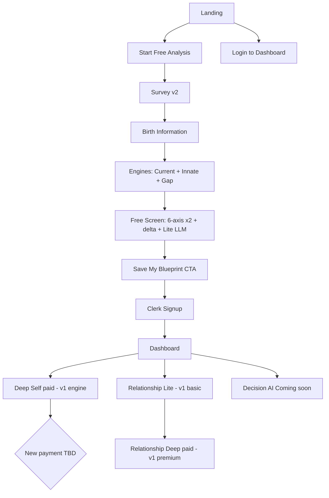
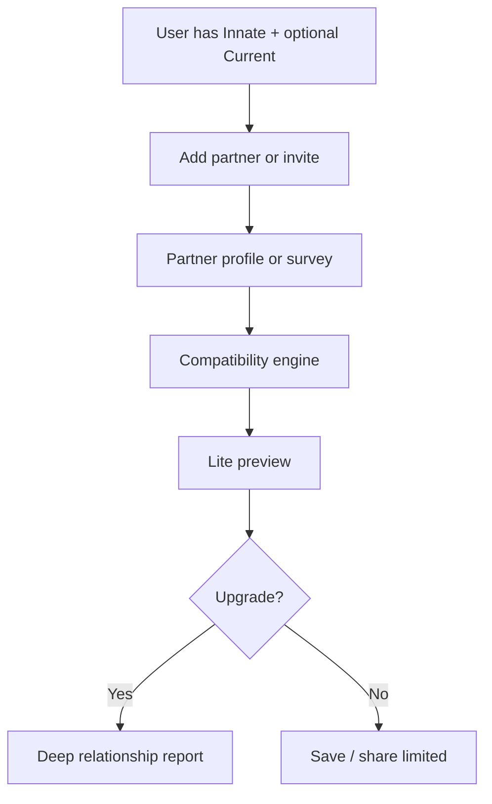

# 00_Master_PRD.md

# Ah, It's Me — Master PRD

Version: MVP v2 · Status: Draft (flow locked 2026-06-28)

---

## Product Overview

**Ah, It's Me** — AI-powered self-understanding and decision intelligence platform.

Help people understand why they think, choose, and relate as they do — not predict the future.

```text
Better Self Understanding → Better Decisions → Better Life
```

---

## Product Category

AI-powered Self Understanding & Decision Intelligence Platform

---

## Mission

Help people understand themselves more deeply so they can make better decisions throughout life.

---

## Vision

Not fortune-telling. Continuous understanding of **Current Self**, **Innate Self**, relationships, and decisions — in one growth engine.

---

## Problem Statement

People make major life decisions with limited self-awareness. Existing tools (personality tests, astrology, journaling, chatbots, coaching) rarely connect into one continuous model of the person.

---

## Our Solution

| Lens | Role |
|------|------|
| Survey | Current Self |
| Saju | Innate Self (reference frame, not destiny) |
| Gap | Why Current and Innate diverge |
| Deep analysis | Patterns behind repeated life experience |
| Relationship | How they interact with others |
| Decision journal | How they actually decide (future) |

Purpose: **better decisions through understanding**, not prediction.

---

## Core Product Philosophy

- We do not tell people who they should become. We help them see who they already are.
- Saju is an **innate reference point**, not fate.
- Calculations are deterministic; interpretation is evidence-based and non-absolute.
- Human language over chart jargon (North America–first tone).

---

## Target Users

**Primary:** Adults seeking clarity before career, relationship, marriage, growth, leadership, or entrepreneurship decisions.

**Secondary:** Interest in personality, psychology, coaching, or structured self-reflection.

---

## Core Features

### Free (MVP)

- Current Self analysis (survey → 6 axes)
- Innate Self analysis (birth data → lite report)
- Gap preview (scores / delta; minimal interpretation)

### Premium (MVP+)

- Deep Self integrated report
- Relationship analysis (Phase 2)
- Decision coaching & journal (Phase 3)
- Full Gap interpretation

---

## MVP Scope

Validate core loop: **Survey v2 → Birth → Current + Innate + Gap (free) → Blueprint save → Signup → Dashboard**.

Includes: landing, survey v2 scorer, saju lite 6-axis, gap rules, hex radar, lite LLM (01/02), dashboard (Deep Self + Relationship Lite), v1 deep engines reuse.

Excludes for Sprint 1: new payment gateway (toss removed), decision journal, decision AI (placeholder only).

Payment: legacy toss/sandbox removed; `payment_status=paid` until new provider ships.

Detail: [03_Product_Roadmap.md](03_Product_Roadmap.md) Phase 1.

---

## Design Principles

- Mobile first · AI native · Decision first
- Evidence based · Human language · Compression first
- Layered insight · Screenshot-worthy recognition (no hype)

---

## Personal Analysis User Flow



**AI pipeline (concept):** Survey v2 → Current Self → Birth → Innate Self → Gap (code) → Lite LLM → Signup → Deep (v1) → Decision (later).

**Signup rule:** Only after full free blueprint preview (Step 6 in `01_Core_User_Flow.md`).

---

## Relationship Analysis User Flow

**Goal:** Compatibility, communication style, decision fit, growth edges.

**Entry (Phase 2):** Manual input · Friend invitation · Public profile.



---

## Decision Intelligence Flow

**Goal:** Turn real decisions into lasting self-knowledge (Phase 3+).

```text
Decision → Reflection → Pattern → Better next decision → Repeat
```

Coaching becomes more personalized as decision history grows.

---

## Premium Funnel

```text
Free: Current Self → Innate Self → Gap preview
Paid: Deep report → Relationship → Decision coach → Journal
```

---

## Core AI Engines (summary)

Survey · Saju · Gap · Pattern · Narrative · Report · UI — each single responsibility. Detail: [01_AI_Architecture.md](01_AI_Architecture.md).

---

## Success Metrics (MVP)

| Area | Signals |
|------|---------|
| Product | Complete free analysis; understand Current vs Innate; upgrade intent |
| Quality | Report completion, satisfaction, low hallucination, fast response |
| Business | Free → paid conversion; retention on journal (later) |

---

## Source of Truth

| Topic | Document / path |
|-------|-----------------|
| **Product (this PRD)** | `docs/v2/PRD/00`–`03` |
| UX steps | `docs/v2/guide/01_Core_User_Flow.md` |
| Pipeline & SSOT | `docs/v2/guide/10_Pipeline_Architecture_v1.md` |
| Survey rules | `docs/v2/survey/` |
| Saju rules | `docs/v2/saju/` |
| Gap rules | `docs/v2/analysis/` |
| Prompt design | `docs/v2/prompt/` |
| Implementation (WhoamI app) | `lib/v2/` (planned) · v1 `lib/saju`, `runPremiumReportPipeline` |
| Implementation tracker | `docs/v2/dev/00_Status.md` |

This PRD defines **what**. Those paths define **how**.
