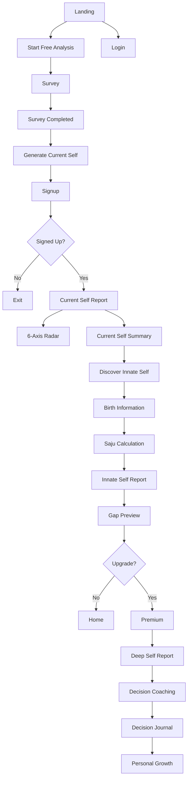

# 01_User_Flows.md

# User Flows

Version: MVP v1

---

# Overview

Ah, It's Me consists of three primary user journeys.

1. Personal Analysis
2. Relationship Analysis
3. Decision Intelligence

Each journey shares the same AI architecture while solving different user needs.

---

# 1. Personal Analysis Flow

## Goal

Help users understand:

* Current Self
* Innate Self
* Why they differ
* Better decisions

---

## Entry

Landing Page

↓

Start Free Analysis

---

## Flow



---

## AI Pipeline

Survey

↓

Current Self

↓

Birth Data

↓

Innate Self

↓

Gap

↓

Deep Analysis

↓

Decision Support

---

# 2. Relationship Analysis

## Goal

Help users understand:

* Compatibility
* Communication
* Decision Style
* Growth Opportunities

Relationship Analysis supports three entry methods.

* Manual Input
* Invitation
* Public Profile

```

(기존 Mermaid 삽입)

```

---

# 3. Decision Intelligence

## Goal

Transform real decisions into continuous self-understanding.

```

Decision

↓

Reflection

↓

Pattern

↓

Better Decision

↓

Repeat

```

Future AI coaching becomes increasingly personalized as decision history grows.

---

# Premium Funnel

Free

↓

Current Self

↓

Innate Self

↓

Gap Preview

↓

Upgrade

↓

Deep Report

↓

Relationship

↓

Decision Coach

↓

Decision Journal

---

# Shared Principles

All user journeys follow the same architecture.

Measure

↓

Interpret

↓

Pattern

↓

Narrative

↓

Report

↓

Action

↓

Learning

The product continuously improves self-understanding through repeated user interactions.
